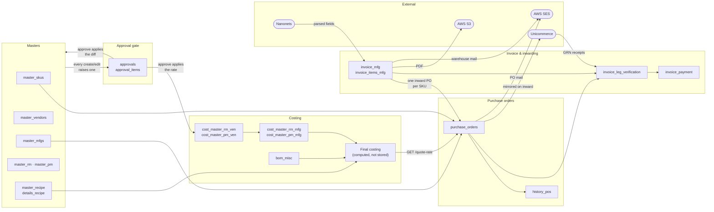
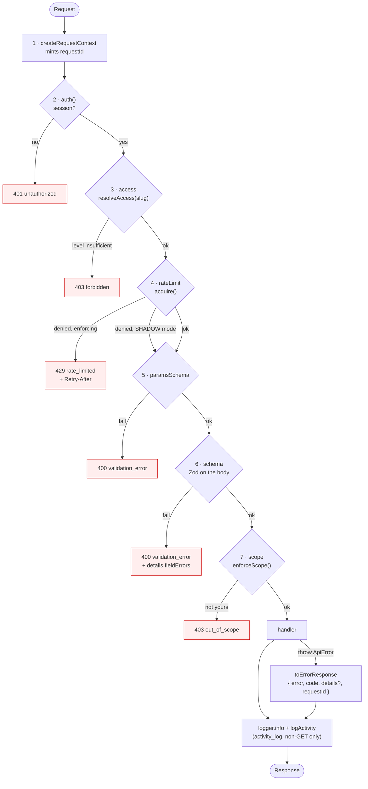
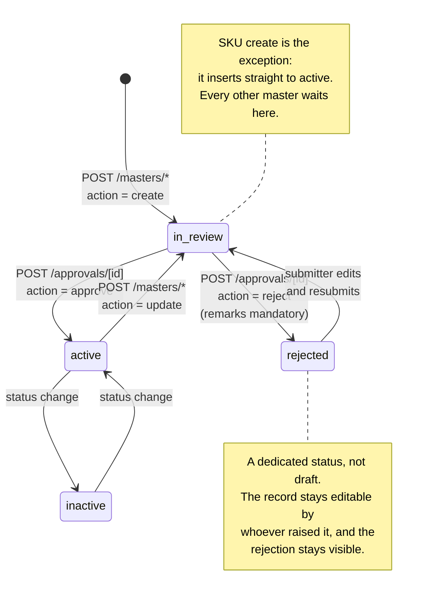
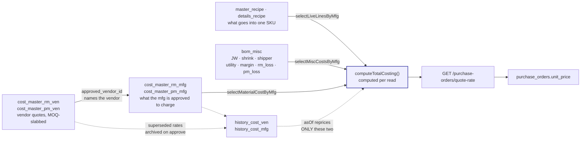
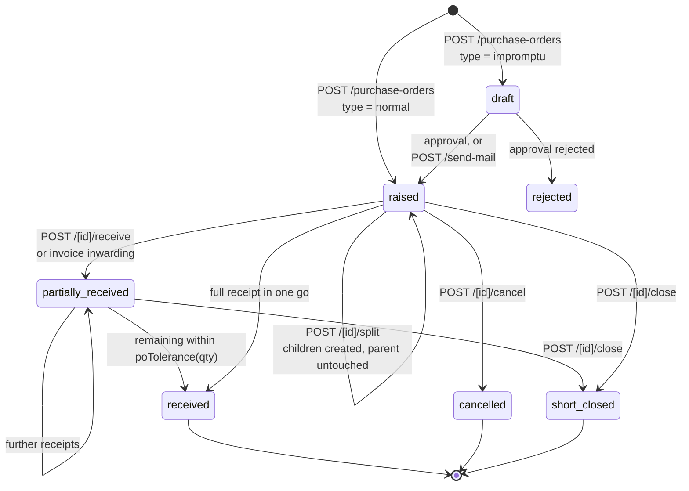
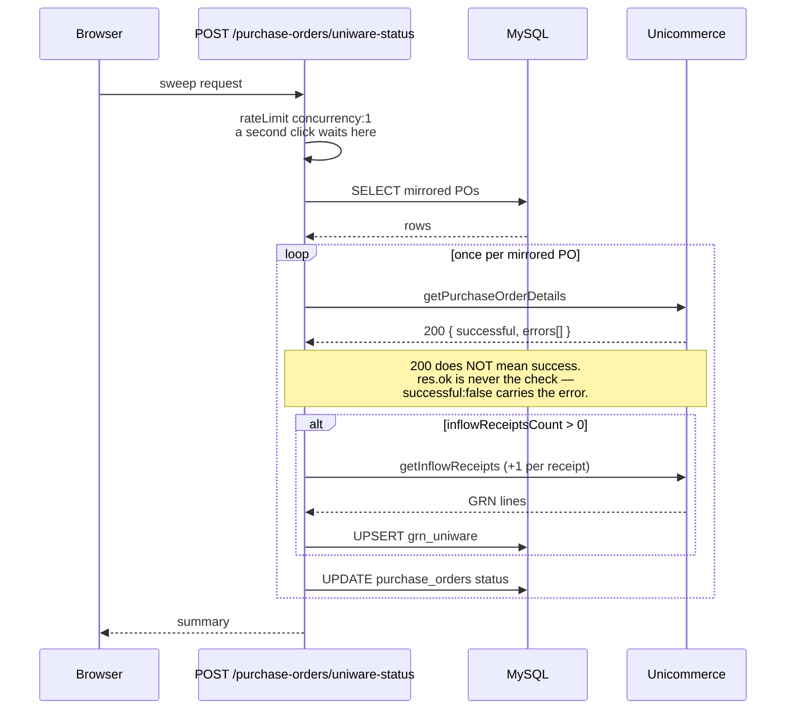
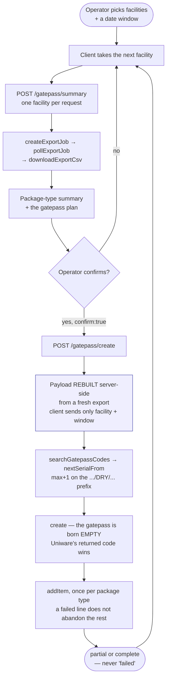
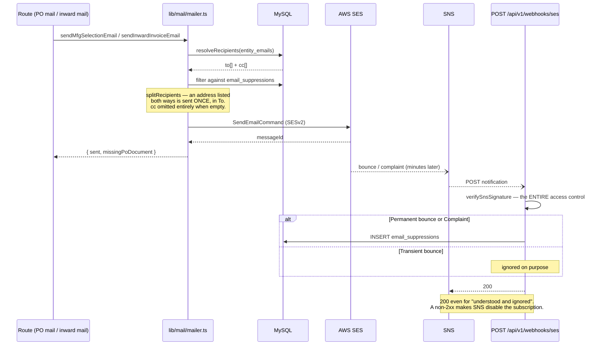
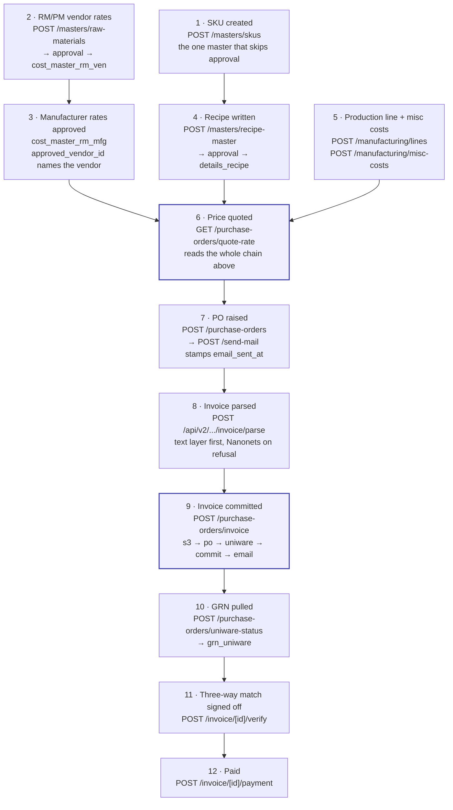

# API Information Flow

> **Related docs:** [API Reference](./api/README.md) · [Conventions](./api/00-conventions.md) · [PO Inwarding](./po-inwarding.md) · [Architecture](./architecture.md) · [Admin & Data Scoping](./admin-and-data-scoping.md)

[`docs/api/`](./api/README.md) answers *what does this endpoint do*. This document
answers *how do the endpoints feed each other* — which module produces the data the
next one consumes, and where a record's state actually changes.

Read [`api/00-conventions.md`](./api/00-conventions.md) first if you have not. Every
arrow in every diagram below passes through the same gateway, described in §2.

Verified against the working tree on 2026-09-24.

---

## 1. The map

Modules as subgraphs. **Edges are data handoffs, not HTTP calls** — a module writes
something the next module reads, whether that happens in one request or six weeks
later. Every later section zooms into one of these edges.



Two things that surprise people, both visible above:

- **Final costing is not a table.** It is computed on every read by
  `lib/costing/final-costing.ts`. Nothing stores it, which is why an old rate change
  silently reprices history unless an `asOf` date is passed.
- **Procurement POs are not mirrored to Unicommerce.** Only *inward* POs — the ones
  raised from a supplier invoice — are. `pushPurchaseOrders` is exported from
  `lib/uniware/index.ts` and has no caller; the only live `createPurchaseOrder()` is
  in `lib/invoice/invoice-inward.ts`.

---

## 2. Every request goes through `withGateway`

This is the funnel. Before any flow below starts, the request has already survived
seven stages, each of which can end it. Drawn as a flowchart rather than a sequence
because the interesting part is **where it exits**, not who talks to whom.



**Three details the picture depends on:**

1. **Scope runs after validation, before the handler.** It has to — the id it checks
   is only a number once Zod has coerced it.
2. **The shadow-mode branch is live today.** `RATE_LIMIT_MODE` defaults to anything but
   `enforce`, so stage 4 computes the denial, logs `wouldBlock: true`, and continues.
   See [known-issues §3](./api/known-issues.md).
3. **Four routes skip the whole funnel**, because their caller cannot have a session:
   `/api/auth/[...nextauth]`, `/api/health`, `/api/v1/uniware/session` (a Chrome
   extension on a `chrome-extension://` origin) and `/api/v1/webhooks/ses` (SNS). For
   the last two, a rate limit plus a signature check *is* the access control.

---

## 3. Masters create → the approval gate

The subject here is a record's **`status` column**, so this is a state diagram. What
it shows that §1 cannot: the rejected-and-resubmitted loop, and the one master that
skips the gate entirely.



**The two-transaction shape.** Submitting and approving are separate writes, and
nothing lands in the master table until the second one:

| | Transaction | Writes |
|---|---|---|
| **Submit** | `POST /api/v1/masters/*` | entity row set to `in_review` · one `approvals` row · one `approval_items` row **per changed field** (a create diffs from nothing, so `old_value = ""`) · a pending `history_masters_edits` row |
| **Approve** | `POST /api/v1/approvals/[id]` | `MODULE_HANDLERS[module].applyAndArchive(...)` · `markApproved` · `resolvePendingHistoryEntry` · then, after commit, `revalidateTag` for every tag in `CACHE_TAGS_BY_MODULE` |

**Bulk uploads invert this.** A CSV never becomes N approvals. The rows are written to
S3 and **one** approval is raised carrying a single `approval_items` row named `s3_key`.
Approving re-reads the CSV from S3 and applies every row in one transaction.

**A pending approval blocks the next edit.** `approvalsSql.hasPending` returns 409
`pending_approval` rather than queueing a second diff against a record whose current
value is already disputed.

**Why the cache bust matters.** Reference lists — dropdown options, agreed rates — are
cached on a timer in `lib/cached-reference-data.ts`. An approval is exactly when they
change, so its tags are busted at commit. Without it a newly approved master is missing
from every dropdown until the timer expires, which users read as *"it didn't save"*.

---

## 4. The costing chain

A dependency graph, not a sequence — nothing here is a request. **Nodes are tables,
edge labels are the resolver that reads them.** This is the only flow with an as-of
date, and the only one whose output is never stored.



**The formula lives in one pure module**, `lib/costing/final-costing.ts`:

```
computeRmCost = amountPct * filling * ratePerKg / 100000
computePmCost = qty * rate
rm_loss and pm_loss apply INDEPENDENTLY, never to the combined cost
MISC_ABSOLUTE = jw · shrink · shipper · utility · margin
```

Every field in `computeTotalCosting` is **required** — no `?? 0`. A missing rate is a
type error at the call site rather than a silent zero in a quoted price.

**The `asOf` asymmetry is the thing to know.** `agreedRatesByMfg(mfgId, brandIds, asOf?)`
reprices only the RM and PM rates, because only they have an archive table. Recipe
lines, `filling` and `bom_misc` are always read **as of today**. Costing a PO "as it
was in March" therefore uses March's rates against today's recipe.

---

## 5. Purchase order lifecycle

Also a state diagram, but a different subject from §3 — that one tracked approval
status, this tracks `purchase_orders.status`. **Each transition is labelled with the
route that causes it**, which is what makes this navigable.



**`poTolerance(qty) = min(100, floor(qty * 0.10))`** — a PO within 10% (capped at 100
units) of its ordered quantity auto-closes as `received`. This is a *different*
tolerance from the three-way match's `MATCH_TOLERANCE = 0.02`; do not conflate them.

**A stored status is not the displayed status.** `isDraftPo()` reads a `raised` PO with
no `email_sent_at` back as **Draft**, because a PO the manufacturer has not been told
about is not really raised:

```ts
export function isDraftPo(po: { status: string | null; email_sent_at: string | Date | null }): boolean {
  return po.status === "draft" || (po.status === "raised" && !po.email_sent_at)
}
```

That is why `POST /[id]/split` refuses those rows with a 409 — the Draft tab lists
them, so "no splitting a draft" has to mean the same set the UI shows, or a row badged
Draft could be split by URL anyway.

`punched` and `rejected` also exist in the `purchase_orders_status` enum. `rejected` is
reached through the approval gate; `punched` has no transition in current code.

---

## 6. Invoice inwarding

**Already documented, with a good sequence diagram — do not duplicate it.** See
[PO Inwarding → The Flow](./po-inwarding.md). Two things belong here rather than there,
because they are properties of the *API contract* rather than of the flow:

**The step order is the rollback strategy.** The pipeline runs
`s3 → po → uniware → commit → email`, and that order is chosen by reversibility: S3
first because `deleteFile` can undo it; the Uniware mirror *inside* the still-open
transaction because it cannot be undone and a later DB failure must not leave an
orphan PO in Unicommerce; email last because it is the only step that reaches a human.

**NDJSON routes always return 200.** Once the stream opens, the status is already sent.
Failure arrives as an event in the body, not as a status code:

```
{"step":"s3","status":"ok"}
{"step":"po","status":"ok"}
{"step":"uniware","status":"warning","message":"Mirror failed — PO saved, retry the sweep"}
{"step":"email","status":"skipped","message":"No warehouse recipients configured"}
{"done":true,"outcome":"partial"}
```

Four routes behave this way: `invoice` POST, `gatepass/summary`, `gatepass/create` and
`facility-map/sync`. A client that switches on HTTP status alone will call every one of
them a success.

---

## 7. Three-way match → payment

A **fan-in** — the only shape of its kind in this document. Three independently sourced
quantities converge on one verdict.

```mermaid
flowchart TD
    subgraph LEGS["The three legs"]
        L1["po — ordered<br/>purchase_orders"]
        L2["pod — accepted<br/>grn_uniware<br/>(labelled GRN in the UI)"]
        L3["inv — billed<br/>invoice_items_mfg"]
    end

    L1 --> CMP{"lib/invoice/three-way.ts<br/>MATCH_TOLERANCE = 0.02"}
    L2 --> CMP
    L3 --> CMP

    CMP -->|"all three agree"| B1["fully_matched"]
    CMP -->|"agree, not signed off"| B2["awaiting_verification"]
    CMP -->|"a leg differs"| B3["variance"]
    CMP -->|"no PO resolved"| B4["unmatched"]

    B2 -->|"POST /invoice/[id]/verify"| SIGN["invoice_leg_verification<br/>stored, per leg"]
    SIGN --> B1
    B1 --> PAYSTART(["payment may begin"])

    style CMP fill:#eef,stroke:#44a,stroke-width:2px
```



**The GRN leg is keyed `pod` everywhere in code.** Only the label says GRN. A query
written against `leg = 'grn'` matches nothing and returns a clean empty set.

**Stored vs derived.** `invoice_leg_verification` and `invoice_payment` are rows.
Everything else on that screen — the badge, and the payment states
`awaiting_documents`, `awaiting_verification`, `blocked` — is computed per read and
stored nowhere.

Payment is linear, so it is a table rather than a fourth state diagram:

| State | Set by | Note |
|---|---|---|
| `pending` | derived | the default when no `invoice_payment` row exists |
| `initiated` → `approved` → `completed` | `POST /invoice/[id]/payment` | manual, one step at a time |
| *(revert)* | same route with `status: null` | drops back to the derived state |

---

## 8. Unicommerce sync sweeps

The first flow with a second system, so this one is a sequence diagram. What it shows
that nothing else does: the **per-PO fan-out** and the lock that serialises it.



**Three traps this flow is shaped around:**

1. **HTTP 200 with `{ successful: false }`** is how a business failure arrives.
   `lib/uniware/envelope.ts` keeps both `description` and `message`, because for
   code-1000 deserialization errors `description` is the useless *"please fill valid
   value"*.
2. **One live OAuth token per user, tenant-wide.** `refreshAccessToken` was deliberately
   deleted — refreshing mints a new token and 401s every other holder of the shared
   account. The cache is capped at 5 minutes instead.
3. **`concurrency: 1` is the point of the rate limit**, not the request count. It stops
   two clicks running two sweeps over the same rows. It is also **not enforced today**
   — see §2.

Related sweeps: `uniware-grn` (GRN pull only, no caller in-repo), `uniware-documents`
(both directions, sandbox-gated), `facility-map/sync` (one facility's Vendor Item
Master export, NDJSON).

### What the sweeps persist

Everything the sweeps read is **stored, not held in memory** — the screens render our
tables, never a live Unicommerce call. Two dedicated GRN tables, plus Uniware columns
bolted onto the invoice and the PO.

#### GRN — `grn_uniware` and `grn_items_uniware`

| Column | Note |
|---|---|
| `grn_code` | **UNIQUE.** Uniware's own `inflowReceiptCode` — the idempotency key that makes a re-sweep an upsert |
| `uniware_po_code` | the mirrored PO this receipt is against; joins `invoice_mfg.uniware_po_code` |
| `invoice_id` | FK → `invoice_mfg`. **Nullable on purpose:** *"NULL = a receipt against a PO we did not mirror"* — so the table also captures GRNs for orders that never went through us |
| `facility_code` | which facility answered — the destination site under the entity billed, matched on PAN |
| `status_code`, `vendor_invoice_no` | the warehouse's own status, and the invoice number as they keyed it — the join back to `invoice_mfg.invoice_no` |
| `grn_created_at` | **Uniware's `created` is epoch MILLISECONDS** — divided by 1000 at ingest |
| `total_qty`, `total_rejected_qty` | denormalised onto the header *"so a list does not need the item join"* |
| `synced_at`, `raw` | when we last read it, and the receipt payload verbatim. **`raw` is marked temporary** in the migration — worth knowing before it is treated as an archive |

`grn_items_uniware` is the line grain: `grn_id`, `line_no`, `sku_code`, `po_id`,
`quantity`, `rejected_qty`, `batch_code`, `expiry`, `mfg_date`. It is the `pod` leg of
the three-way match in §7.

#### Uniware status lives on the INVOICE, not the PO

```
invoice_mfg.uniware_po_code     VARCHAR(64)
invoice_mfg.uniware_status      VARCHAR(40)
invoice_mfg.uniware_synced_at   DATETIME
invoice_mfg.uniware_grn_count   INT          -- inflowReceiptsCount, last seen
```

> ⚠️ **`purchase_orders` has no `uniware_status` column.** It carries only
> `uniware_po_code`. Where the PO list appears to show a Uniware status, that is a
> correlated subquery reaching into `invoice_mfg`
> (`lib/queries/purchase-orders.ts:252`). A query written against a PO-side status
> column returns nothing, cleanly.

`purchase_orders` does separately store Uniware's **own line numbers**, and the
migration comment is emphatic about what they are not:

```
un_pending_qty     DECIMAL(12,3)  -- "Unicommerce pendingQuantity for this PO line.
                                  --  THEIRS, not ours — never derive received_qty from it"
un_qc_pass_qty     DECIMAL(12,3)  -- qcPassQuantity
un_line_synced_at  DATETIME       -- "NULL = never asked, which is not the same as
                                  --  Uniware reporting zero"
```

#### Two null rules that decide what gets re-swept

- **`uniware_status IS NULL` means both "never mirrored" and "not asked yet."** The
  sweep-targeting query in `lib/queries/supplier-invoices.ts` treats NULL as
  never-synced and always re-includes it.
- **Re-polling stops only at a terminal status:**
  `TERMINAL_UNIWARE_STATUSES = ["COMPLETE", "CANCELLED"]`
  (`lib/queries/supplier-invoices.ts:33`). Everything else is swept again, every run.

---

## 9. Gatepass — the browser is the scheduler

A flowchart, deliberately not a sequence diagram, because the point is **where the loop
lives**. There is no queue and no worker in this repo; the client drives one facility
per request.



**Nothing is written to our database.** Gatepass state lives entirely in Unicommerce,
which is also why there is no rollback: Uniware has no delete for a gatepass, so a run
that adds three of five lines is reported as **partial**, with the gatepass code and
per-item outcomes, rather than as a failure.

**The payload is rebuilt server-side on create.** The client's summary may be minutes
old; orders move. Re-exporting and re-running `blockers()` at create time is what stops
a gatepass being raised against a stale plan.

---

## 10. Email, and the SES bounce loop

The only **asynchronous callback** in the system — the return arrow comes back minutes
later, on a different connection, with no session. That is what a sequence diagram is
for and a flowchart cannot express.



**Only permanent bounces and complaints suppress.** A transient bounce is a full
mailbox, not a dead address; suppressing on it would silently stop mailing a live
warehouse.

**The webhook returns 200 for almost everything.** 403 only on a bad signature. This
looks wrong until you know that a non-2xx makes SNS disable the whole subscription —
at which point every future bounce is lost.

---

## 11. The spine — one SKU, end to end

What no other document traces: a single product from master creation to a paid supplier
invoice, with the route that performs each hop.



Steps 2–5 each pass through the approval gate of §3. Steps 6–12 do not — once a master
is approved, the transactional flow runs without further sign-off, except for the
explicit human verification at step 11.

---

## 12. Where each flow is enforced

The link back: which routes implement each flow, and which module guards it.

| Flow | Routes | Guard |
|---|---|---|
| Gateway funnel (§2) | all 101 handlers | `lib/gateway/with-gateway.ts` · `errors.ts` · `scope-rules.ts` · `rate-limit.ts` |
| Approval gate (§3) | [`approvals.md`](./api/approvals.md) · [`masters.md`](./api/masters.md) | `lib/approvals/module-handlers.ts` |
| Costing chain (§4) | [`manufacturing.md`](./api/manufacturing.md) | `lib/costing/final-costing.ts` (pure) · `agreed-rates.ts` |
| PO lifecycle (§5) | [`purchase-orders.md`](./api/purchase-orders.md) | `lib/po/po-rules.ts` · `po-receive.ts` · `po-guard.ts` |
| Invoice inwarding (§6) | [`invoice.md`](./api/invoice.md) | `lib/invoice/invoice-inward.ts` · `invoice-mapping.ts` |
| Three-way match (§7) | [`invoice.md`](./api/invoice.md) | `lib/invoice/three-way.ts` (pure) |
| Uniware sweeps (§8) | [`uniware.md`](./api/uniware.md) | `lib/uniware/*` · `envelope.ts` · `auth.ts` |
| Gatepass (§9) | [`uniware.md`](./api/uniware.md) | `lib/gatepass/{fetch,plan,create}.ts` |
| Email + bounces (§10) | [`admin-and-files.md`](./api/admin-and-files.md) | `lib/mail/mailer.ts` · `recipients.ts` · `sns-verify.ts` |
| Data scoping (all) | — | `lib/scope.ts` · `brand-guard.ts` · `po-guard.ts` · `s3-guard.ts` |

> **Scoping runs through every flow above.** The rule that catches people: in
> `user_entity_scope`, **no rows means unrestricted, not "nothing"**. A user with no
> scope rows sees everything. See [Admin & Data Scoping](./admin-and-data-scoping.md).
