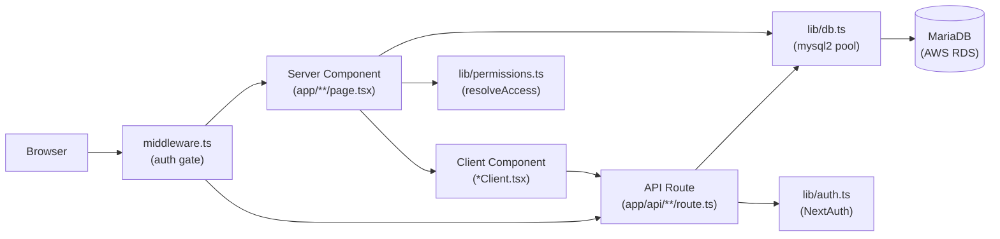
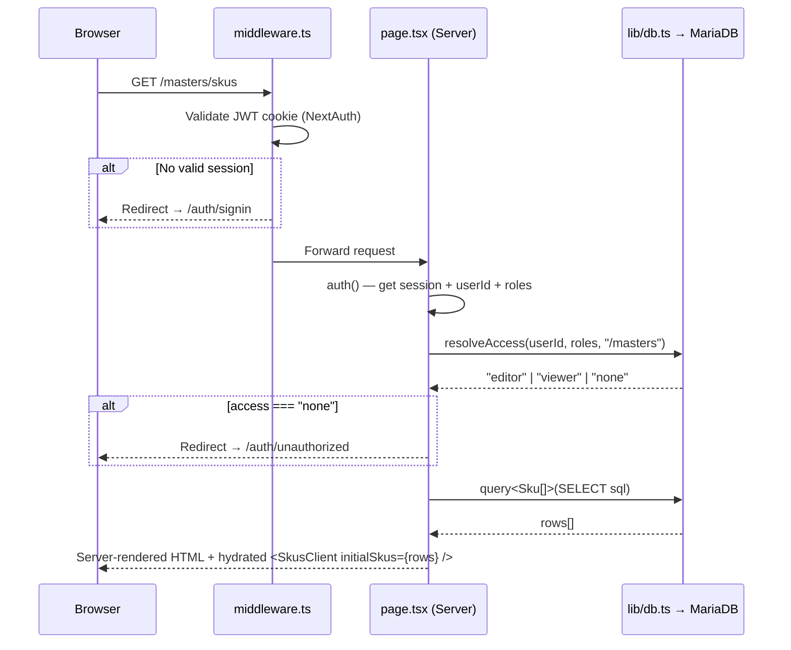

# System Architecture

> **Related docs:** [Database Schema](./database-schema.md) · [Authentication & Permissions](./authentication-and-permissions.md) · [Frontend Patterns](./frontend-patterns.md)

## Technology Stack

| Technology | Version | Role | Notable constraint |
|------------|---------|------|--------------------|
| Next.js | 16 | Full-stack framework (App Router) | `serverExternalPackages: ["mysql2"]` required |
| React | 19 | UI rendering | Server Components for data, Client Components for interactivity |
| TypeScript | 6 | Type safety across the entire codebase | Strict mode enabled |
| Tailwind CSS | v4 | Utility-first styling | CSS-first config — no `tailwind.config.js` needed for most customisation |
| shadcn/ui + Radix UI | — | Component library | Components live in `components/ui/`; use the shadcn CLI to regenerate |
| mysql2 | 3 | Runtime database access | Connection pool in `lib/db.ts`; NOT Prisma Client |
| Prisma | 7 | Schema definition and migrations **only** | Client generated to `app/generated/prisma/` — not imported at runtime |
| NextAuth | v5 beta | Authentication | Google OAuth only, JWT strategy |
| MySQL / MariaDB | 8.0 on RDS | Primary database (AWS RDS) | Accessed via `mysql2` connection pool |

> **Engine note:** the RDS instance is **real MySQL 8.0**, despite this project's docs historically saying MariaDB. Practical consequence: there is no `ADD COLUMN IF NOT EXISTS`, so the hand-written `prisma/*.sql` migrations that add columns are **not** re-runnable (they error on the duplicate column). `CREATE TABLE IF NOT EXISTS` and `MODIFY COLUMN` ones are. Each file's header says which it is.

### External services

| Service | Module | Used for | Behaviour when unconfigured |
|---------|--------|----------|----------------------------|
| AWS S3 | `lib/s3.ts` | File uploads, PO attachments, invoice PDFs, event logs | Required — fails at boot |
| Gmail SMTP | `lib/mailer.ts` | PO dispatch to manufacturers, inward-invoice notice to warehouses | Required — fails at boot |
| Nanonets | `lib/nanonets.ts` | Supplier-invoice field extraction (50–70s per PDF) | Required — fails at boot |
| Uniware (Unicommerce) | `lib/uniware.ts` | Mirroring inward POs to the WMS | **Optional** — `uniwareEnabled()` false ⇒ the mirror step is skipped, not failed |

## High-Level Component Map



## Authenticated Page Load Lifecycle



## API Mutation Lifecycle

```mermaid
sequenceDiagram
    participant C as Client Component
    participant R as route.ts (API)
    participant DB as lib/db.ts → MariaDB

    C->>R: POST /api/masters/skus\n{ action: "create", sku_code: "SKU001", name: "..." }
    R->>R: auth() — verify session (401 if missing)
    R->>R: Parse body, validate required fields (400 if missing)
    R->>DB: execute(INSERT INTO skus ...)
    DB-->>R: ResultSetHeader { insertId: 42 }
    R-->>C: 200 { id: 42 }
    C->>C: router.refresh()
    note over C: Triggers Server Component re-fetch;\nnew row appears in table
```

## Directory Map

| Path | Purpose |
|------|---------|
| `app/` | Next.js App Router — all pages, layouts, and API routes |
| `app/api/` | REST API route handlers (mutations only; reads happen in server components) |
| `app/masters/` | The fully-implemented Masters module (SKUs, Vendors, Manufacturers, RM, PM, BOM) |
| `app/admin/` | Admin panel — Users · Permissions · Data Access · Activity. One access guard in `layout.tsx`; `authority.ts` mirrors `resolveAccess` for display. See [Admin Panel & Data Scoping](./admin-and-data-scoping.md) |
| `app/approvals/` | Approval queue. `approval-card/` holds the card and its per-shape diff renderers (field diff, BOM line diff, CSV diff, entity info, actions) |
| `app/po-tracking/po-inwarding/` | Goods-receipt desk + the Add Invoice flow. See [PO Inwarding](./po-inwarding.md) |
| `app/auth/` | Sign-in, error, and unauthorised pages |
| `app/generated/prisma/` | **Auto-generated** Prisma Client — do not edit; do not import in application code |
| `components/` | Shared React components |
| `components/ui/` | shadcn/ui component primitives (Button, Input, Dialog, Table, Badge, Tabs, Callout, Stepper, SegmentedToggle, SortableTableHead, ToggleButton, IconActionButton, …) |
| `components/masters/` | Reusable masters UI: AddRecordDialog, CsvImportDialog, MasterToolbar, SearchInput, FormField, ApprovalBanners, RateHistoryDialog, MaterialComparisonDialog, EntityHistoryDialog, RecordCountHeader, TruncatedCell, ManagedFuzzyField |
| `lib/` | Core server-side utilities |
| `lib/db.ts` | mysql2 connection pool singleton with `query()` and `execute()` helpers |
| `lib/auth.ts` | NextAuth configuration, callbacks, and session management |
| `lib/permissions.ts` | `resolveAccess()` — the page-access decision function |
| `lib/pages.ts` | The canonical permission-controlled page-slug list — one source for the admin grid, sidebar locks, and breadcrumb labels |
| `lib/roles.ts` | The declared role taxonomy (4 domains × 3 designations + `developer`/`admin`) and its derived helpers |
| `lib/scope.ts` | Per-user entity scoping — `getUserScope`, `scopeClause`/`scopeParams`, `assertInScope`, `filterByScope`. Absence of rows = unrestricted |
| `lib/po-guard.ts` | `assertPoInScope` — scope guard every `/api/purchase-orders/[id]/**` route needs (ids are guessable) |
| `lib/admin-guards.ts` | `assertNotSelfLockout` / `assertNotSelfScope` — refuse admin changes with no UI recovery path |
| `lib/gateway/with-gateway.ts` | The route wrapper: auth → access rule → Zod → handler → structured error shape, plus the `activity_log` write on every non-GET |
| `lib/invoice-inward.ts` | The whole supplier-invoice → inward-PO sequence (S3 → DB → Uniware → email) and its compensation rules |
| `lib/nanonets.ts` | Invoice field extraction wire format (`/extract/sync`, not `/parse/sync`) |
| `lib/invoice-mapping.ts` | Fuzzy mapping from what an invoice prints to what the masters hold (Fuse.js) |
| `lib/uniware.ts` | Unicommerce OAuth + purchase-order create/fetch |
| `lib/po-receive.ts` | Shared goods-receipt logic — tolerance, auto-close, `history_pos` row. Used by both the manual and invoice paths |
| `lib/costing/final-costing.ts` | The Agreed Final Costing formula, in one place: RM % of fill weight, PM per unit, per-side wastage, total |
| `lib/masters/bom-version.ts` | `diffBomLines` — independent RM/PM version bumps behind the `<sku>RM<n>PM<n>` BOM code |
| `lib/logger.ts` | Winston structured logger — console (pretty) + daily-rotate file transports. Import as `import logger from "@/lib/logger"` in any route or server-side file. |
| `lib/mailer.ts` | PO email dispatch via Gmail SMTP (nodemailer). `fetchPoData()` shared between email send and PDF preview. |
| `lib/s3.ts` | S3 helpers: presigned URLs, file upload/download, fire-and-forget event writes |
| `lib/events.ts` | Thin wrappers around `putEvent` — `recordRawEvent`, `recordProcessedEvent`, `recordFailedEvent` |
| `lib/utils.ts` | `cn()` — Tailwind class name utility |
| `lib/constants.ts` | Typed `STATUS` and `APPROVAL_STATUS` const objects — use these instead of raw string literals across the codebase |
| `lib/queries/` | SQL statement strings grouped by domain — now also `users.ts`, `entity-scope.ts`, `activity.ts`, `supplier-invoices.ts` |
| `lib/queries/history.ts` | `historySql` — generic per-module audit trail (`history_masters_edits`), populated alongside the approvals mechanism on every create/edit/delete submission |
| `lib/master-routes/history-utils.ts` | `insertHistoryEntry` / `resolvePendingHistoryEntry` — shared helpers a module route calls to write/resolve its history row; the approve/reject route resolves it automatically regardless of module |
| `lib/approvals/module-handlers.ts` | Strategy pattern registry — aggregates and re-exports `MODULE_HANDLERS` (`SKU`, `RM_RATE`, `PM_VRM`, `*_BULK`, etc.); the actual `setStatus`/`applyAndArchive` logic per module lives in `lib/approvals/handlers/<domain>.ts` (one file per domain: `sku.ts`, `raw-materials.ts`, `packing-materials.ts`, `vendors.ts`, `manufacturers.ts`, `purchase-orders.ts`, `bom.ts`, plus shared `types.ts`); adding a new module means adding one handler object in the relevant domain file and registering it in the top-level `MODULE_HANDLERS` map — the route never changes |
| `lib/pdf/po-document.tsx` | React PDF template for PO documents — renders branded A4 PDF, used by preview and email send |
| `types/` | TypeScript types for database row shapes and NextAuth session augmentation |
| `prisma/` | `schema.prisma` (source of truth for DB models) + migration history |
| `scripts/` | One-off utility scripts (seed, test-connection) |
| `logs/` | Winston log output — `app-YYYY-MM-DD.log` (all levels, 14-day retention) and `error-YYYY-MM-DD.log` (errors only, 30-day retention). Gitignored. |
| `public/` | Static assets served directly by Next.js |

## The Prisma / mysql2 Split

This is the most common point of confusion in this codebase.

**`prisma/schema.prisma`** is the single source of truth for the database structure. It is used to:
- Generate SQL migration files (`npx prisma migrate dev`)
- Apply migrations in production (`npx prisma migrate deploy`)
- Browse the schema visually (`npx prisma studio`)

**At runtime, nothing uses Prisma Client.** All database calls go through `lib/db.ts`:

```ts
// lib/db.ts — the only database interface in application code
export async function query<T>(sql: string, params?: any[]): Promise<T[]>
export async function execute(sql: string, params?: any[]): Promise<mysql.ResultSetHeader>
```

SQL strings live in `lib/queries/<domain>.ts` and are called from API routes and server components.

```ts
// DO: import from lib/db.ts
import { query, execute } from "@/lib/db";

// DO NOT: import from generated Prisma client at runtime
import { PrismaClient } from "@/app/generated/prisma"; // ← wrong
```

## Stub Modules

The following modules have an `app/<module>/page.tsx` file showing a "Coming soon" placeholder. No API routes or database logic exist for them yet.

- `app/finance/`
- `app/hr-payroll/`
- `app/inventory/`
- `app/sales-crm/`
- `app/reports/`

> `app/manufacturing/` is no longer a stub — it is the **MFG Cost Manager**. `/manufacturing/[mfgId]` carries seven tabs: SKUs (manufacturing lines, with `active` / `discontinued` / `inactive` status counts), Misc. Cost, Approved Procurement Rates, Agreed Rates, Agreed Final Costing (plus a cheapest/max-vendor comparison table), and two placeholders with no backend yet — Common RMs and Vendor Ing Mapping. Costing math lives in `lib/costing/final-costing.ts` so the rate table, the comparison tables, the exports and PO quote-rate all share one formula. Both the page and every `/api/manufacturing/**` route enforce entity scope on `mfgId`.

> The former `tech_transfer` line status is gone, and `on_hold` was renamed: `master_bom_mfg.status` is now `active` / `discontinued` / `inactive` (`discontinued` = still live but winding down; `inactive` = no new POs). It's a `VARCHAR(50)`, not a DB enum, so the change was pure data migration — `prisma/rename_mfg_line_on_hold_to_inactive.sql` and `add_manufacturing_v2_columns.sql`.

> `app/po-tracking/` is **fully implemented**, and now includes supplier-invoice inwarding — see [PO Inwarding](./po-inwarding.md). PO types are `normal` / `impromptu` / `inward`. A PO's lifecycle runs `raised` → `split` (into child POs via `app/api/purchase-orders/[id]/split/route.ts`) and/or `receive` (partial or full goods receipt via `app/api/purchase-orders/[id]/receive/route.ts`, auto-closing to `received` once the remainder is within tolerance) → `cancel` / `short_close` for early termination. The procurement table (`app/po-tracking/po-procurement/PoTable.tsx`) delegates cell rendering to `PoTableCells.tsx` and row actions to `PoActionMenu.tsx`, with one dialog per action (`SplitPODialog.tsx`, `ReceivePODialog.tsx`, `CancelPODialog.tsx`, `ShortClosePODialog.tsx`). See [API Reference](./api-reference.md#purchase-orders) for the full PO API surface.

See [Adding a New Module](./adding-a-new-module.md) for how to implement one from scratch, and [docs/architecture-evolution.md](./architecture-evolution.md) for the planned gateway + events pattern to adopt when building them.
