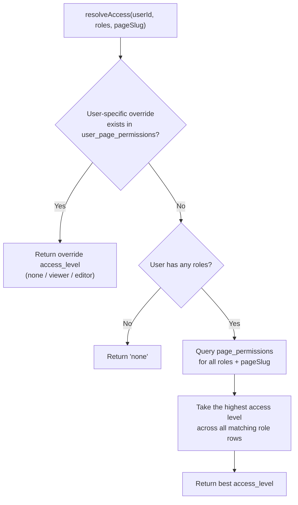

# Authentication & Permissions

> **Related docs:** [Architecture](./architecture.md) · [Database Schema](./database-schema.md) · [API Reference](./api-reference.md) · [Admin Panel & Data Scoping](./admin-and-data-scoping.md)

## Authentication Stack

| Layer | Technology | Details |
|-------|------------|---------|
| Provider | Google OAuth 2.0 | No password login. Email must exist in `users` table. |
| Auth library | NextAuth v5 (beta) | `next-auth@5.0.0-beta.31` |
| Session strategy | JWT (stateless) | Cookie-based; token signed with `AUTH_SECRET` |
| Configuration | `auth.config.ts` + `lib/auth.ts` | Config object + full NextAuth setup with callbacks |

## Sign-In Flow

```mermaid
sequenceDiagram
    participant B as Browser
    participant G as Google OAuth
    participant NA as NextAuth (lib/auth.ts)
    participant DB as MariaDB

    B->>G: Click "Sign in with Google"
    G-->>B: OAuth consent screen
    B->>G: User grants permission
    G-->>NA: Callback with user profile (email, name, sub)
    NA->>NA: signIn callback
    NA->>DB: SELECT from users WHERE email = ?
    alt User not found or status = 'inactive'
        NA-->>B: Redirect → /auth/error (AccessDenied)
    end
    NA->>NA: jwt callback — load userId + roles from DB
    NA->>DB: SELECT roles from user_roles WHERE user_id = ?
    DB-->>NA: roles[]
    NA->>NA: Stamp { userId, roles } into JWT token
    NA->>NA: session callback — expose userId + roles on session.user
    NA->>NA: events.signIn — write session record + session_history "login"
    NA->>DB: INSERT INTO sessions ...
    NA->>DB: INSERT INTO session_history (event: 'login') ...
    NA-->>B: JWT cookie set; redirect → /
```

## Middleware Gate (`middleware.ts`)

The middleware runs on **every request** except:
- `_next/static` — Next.js static assets
- `_next/image` — Next.js image optimisation
- `favicon.ico`
- `public/` — static files

What it does:
- Validates the JWT cookie using NextAuth
- Redirects unauthenticated requests to `/auth/signin`

What it does **not** do:
- Check page-level permissions (that happens inside each server component)
- Authorise API routes (each route calls `auth()` manually)

## Three Access Dimensions

| Dimension | Question | Where | Managed in |
|-----------|----------|-------|-----------|
| Role grant (`page_permissions`) | Can this role open this screen? | `lib/permissions.ts` → `resolveAccess()` | `/admin/permissions` |
| Per-user override (`user_page_permissions`) | …with an exception for this one person? | same | `/admin/permissions` |
| **Entity scope** (`user_entity_scope`) | **Whose rows does this person see on it?** | `lib/scope.ts` | `/admin/data-access` |

The first two are resolved together by `resolveAccess()` and produce `none` / `viewer` / `editor`. The third is independent and orthogonal: a user needs page access to reach `/manufacturing` at all, **and** an in-scope manufacturer to see a given one. See [Admin Panel & Data Scoping](./admin-and-data-scoping.md) for the scoping model in full.

### Roles are a declared list (`lib/roles.ts`)

Roles used to be free text — `user_roles.role` and `page_permissions.role` are `VARCHAR(100)`, and the admin UI derived its list by unioning those two tables, so a typo created a permanent phantom role. The taxonomy is now declared: **4 domains (RM · PM · Production · Cost) × 3 designations (Head · Lead · Executive)**, keyed `${domain}_${designation}`, plus the two system roles `developer` and `admin`. The users and permissions routes validate with `z.enum(ROLE_KEYS)`.

Nothing in the app branches on a role name — there is no `if (role === ...)` anywhere. **A role's only power is the `page_permissions` rows attached to it.**

Existing databases are migrated by `prisma/migrate_role_taxonomy.sql`, which also clears every `page_permissions` row outside `developer`/`admin` — access is granted from the tool now, not seeded.

### Layer 1 — Role grants (`page_permissions`)

`npm run db:seed` (`scripts/seed-permissions.ts`) no longer seeds a role × page matrix. It seeds exactly two rules, both because their slugs have **no parent** for the parent-walk to fall back to, which makes them deny-by-default with no way to fix from inside the UI:

| Slug | Seeded for | Why |
|------|-----------|-----|
| `/admin` | `developer`, `admin` (`editor`) | Otherwise nobody can open the admin panel |
| `/approvals` | the four `*_head` roles (`editor`) | Approvals are done by Head; derived from `APPROVER_ROLES` so a new domain can't be added without its Head getting approval rights |

Everything else is granted from `/admin > Permissions`. A role with no rows for a slug resolves to `"none"` and the user is redirected to `/auth/unauthorized`.

### Layer 2 — User-specific overrides (`user_page_permissions`)

A per-user entry for a `page_slug` overrides the role-based access **at that slug level**. Managed via `/api/admin/user-permissions`. Useful for granting a single user elevated or restricted access without changing their role.

> **The order that surprises people:** `resolveAccess` walks the slug up its parents and checks **override then role at each level** before moving up. So a role grant on `/masters/vendors` beats an override on `/masters` — depth wins before layer does. `app/admin/authority.ts` mirrors this walk for display; any change to `resolveAccess` belongs there too.

### Removing a grant: `DELETE`, not `'none'`

`Inherit` in the admin UI means *no row at all* and is sent as a `DELETE`. An explicit `access_level = 'none'` row **stops** the parent-slug walk — a stronger and different statement than having no row.

## `resolveAccess()` — The Decision Function

**File:** `lib/permissions.ts`



Access levels rank: `none` (0) < `viewer` (1) < `editor` (2). Across multiple roles the **best** level wins; an override at the same slug replaces the role result outright.

### Using access in a server component

```ts
import { auth } from "@/lib/auth";
import { resolveAccess } from "@/lib/permissions";
import { redirect } from "next/navigation";

export default async function SkusPage() {
  const session = await auth();
  if (!session) redirect("/auth/signin");

  const userId = Number(session.user.id);
  const access = await resolveAccess(userId, session.user.roles, "/masters");
  if (access === "none") redirect("/auth/unauthorized");

  // access is "viewer" or "editor" — proceed to fetch data
}
```

### Using access in an API route

API routes do **not** check auth by hand any more. `withGateway()` (`lib/gateway/with-gateway.ts`) resolves the session, enforces the access rule, validates the body with Zod, stamps a request context, logs the request and records the `activity_log` row:

```ts
export const POST = withGateway({
  schema: myZodSchema,
  access: { pageSlug: "/admin", level: "editor" },
  handler: async ({ body, params, session, ctx }) => {
    // session is guaranteed; body is typed and validated
    return NextResponse.json({ ok: true })
  },
})
```

- Missing session → `401`; insufficient access → `403`; schema failure → `400`, all before the handler runs.
- Errors are serialised as `{ error, code, details?, requestId }` by `toErrorResponse`; throw `ApiError(status, code, message)` for anything you want surfaced to the user.
- **Entity scope is not part of `access`** — routes that address a single record must additionally call `assertInScope(...)` (or `assertPoInScope` for POs). Route-level scoping is opt-in per route, by design.

### Activity logging

Every **non-GET** request through `withGateway` writes one `activity_log` row (method, path, status, duration, IP, user-agent, `request_id`) — fire-and-forget, so an audit-row failure can never fail the request it describes. GETs are skipped deliberately: every page load and dropdown fetch would land a row for no audit value. Read at `/admin/activity`, unioned with `session_history`.

## Admin Endpoints

All of these are gated on the `/admin` page slug (`viewer` to read, `editor` to write) rather than a hardcoded role check. Managed from the [admin panel](./admin-and-data-scoping.md).

| Endpoint | Method | Description |
|----------|--------|-------------|
| `/api/admin/users` | POST · PATCH | Create / update a user and replace their roles. No DELETE — deactivate with `status = 'inactive'`. |
| `/api/admin/permissions` | GET · POST · DELETE | Role-page grants. `DELETE` clears the row so the slug inherits from its parent again. |
| `/api/admin/user-permissions` | GET · POST · DELETE | Per-user overrides (`?user_id=` filters the GET) |
| `/api/admin/entity-scope` | PUT | Replaces one `(user, entity_type)` scope set. `entity_ids: null` (or `[]`) clears it, which means **unrestricted**. |

Both permission-writing routes and the entity-scope route call the guards in `lib/admin-guards.ts` so an admin cannot lock themselves out of `/admin`, or change their own data scope, from the UI.

## Session Lifecycle (Database Side)

| Event | What happens in the DB |
|-------|------------------------|
| Sign in | INSERT into `sessions` (UUID `session_id`, `is_active = true`); INSERT into `session_history` (`event = 'login'`) |
| Sign out | UPDATE `sessions` SET `is_active = false`; INSERT into `session_history` (`event = 'logout'`) |
| Token refresh | INSERT into `session_history` (`event = 'token_refreshed'`) |
| Session expiry | Status updates to `expired` in `session_history` |
| Admin revocation | Status updates to `revoked` in `session_history` |

The `sessions` table holds the **current state**. `session_history` is **append-only** and never mutated.

## AUTH_SECRET Warning

`AUTH_SECRET` is used to sign JWT cookies. If you change this value (in `.env` or on the server), **every existing session cookie becomes invalid**. All signed-in users will be silently logged out on their next request and redirected to the sign-in page. Coordinate this change with the team if users are actively working.
