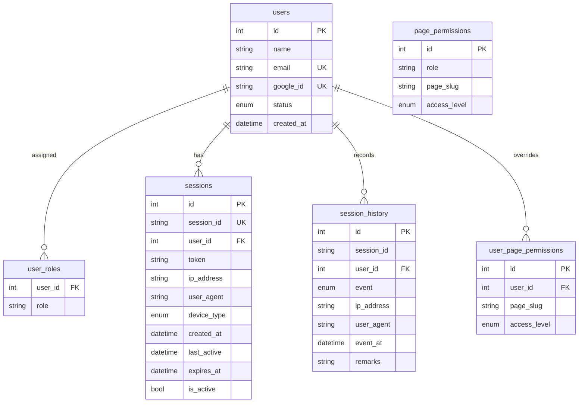
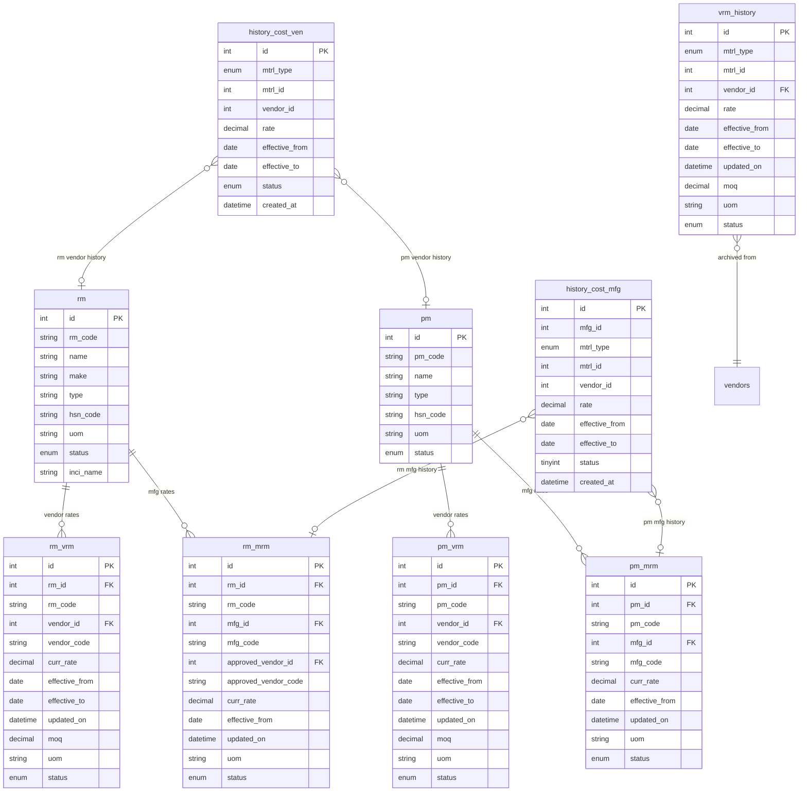
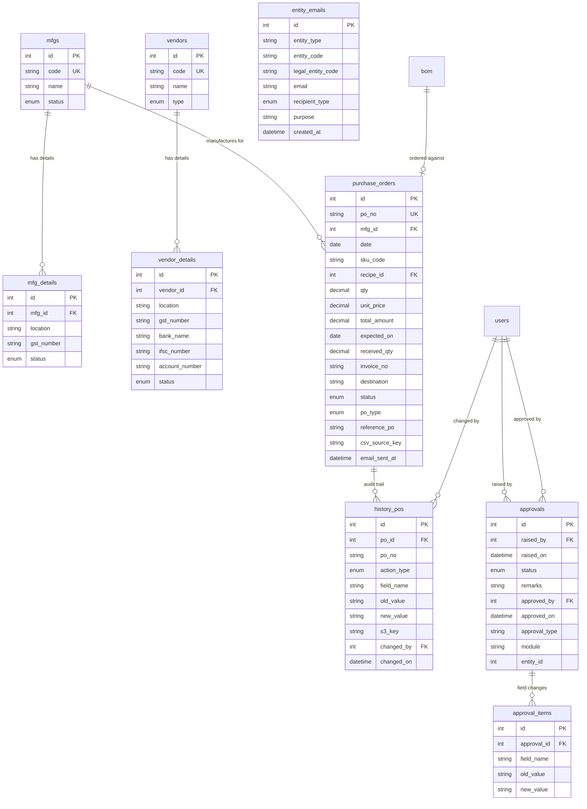

# Database Schema Reference

> **Related docs:** [Architecture](./architecture.md) · [Authentication & Permissions](./authentication-and-permissions.md)

> ⚠️ **Read the rename table below before trusting `prisma/schema.prisma`.**
> The database was renamed in 2026-08 and the Prisma schema was **not** updated —
> it is schema-only and unused at runtime, so nothing broke, but its model names
> for the recipe / cost-master / invoice tables are now historical.

The source of truth for all models is **`prisma/schema.prisma`**. This document groups them by business domain, describes relationships, and explains naming conventions.

At runtime, queries are raw SQL strings in `lib/queries/<domain>.ts` executed via `lib/db.ts`. Prisma Client is not used at runtime.

---

## Domain 1 — Users & Authentication



### Table descriptions

**`users`** — System user accounts. Only users with `status = 'active'` can sign in. Populated manually or via the seed script; Google OAuth matches on `email`.

**`user_roles`** — Many-to-many role assignments. Composite PK `(user_id, role)`. The column is a plain `VARCHAR(100)`, but the **valid values are declared in `lib/roles.ts`** and validated with `z.enum(ROLE_KEYS)` at the API boundary: `developer`, `admin`, and `{rm,pm,production,cost}_{head,lead,executive}`. Existing databases are converted by `prisma/migrate_role_taxonomy.sql`; `scripts/_check-role-taxonomy.ts` asserts no legacy strings survived.

**`sessions`** — One active row per signed-in session. `session_id` is a UUID. `is_active = false` means the user signed out or the session was revoked.

**`session_history`** — Append-only audit log. Events: `login`, `logout`, `expired`, `revoked`, `token_refreshed`.

**`page_permissions`** — Role-based access grants. Unique key `(role, page_slug)`. Access levels: `none`, `viewer`, `editor`. `npm run db:seed` now seeds only `/admin` (developer + admin) and `/approvals` (the four `*_head` roles) — the slugs with no parent to inherit from. Everything else is granted from `/admin > Permissions`. Slugs themselves are declared in `lib/pages.ts`.

**`user_page_permissions`** — Per-user overrides that take precedence over the role grant **at the same slug level**. Managed via `/api/v1/admin/user-permissions`. Note the resolution order: `resolveAccess` checks override *then* role at each slug before walking up to the parent, so a role grant on a deeper slug beats an override on a shallower one.

**`user_entity_scope`** — Per-user data scoping: which manufacturers / vendors / warehouses a user's rows are limited to. PK `(user_id, entity_type, entity_id)`; `entity_type` is `ENUM('mfg','vendor','warehouse')`.

> **The absence of rows for a `(user_id, entity_type)` pair means UNRESTRICTED**, not "nothing". Rows present = allow-list. That's why there is no "all" marker row: an admin narrows access by adding rows and widens it by deleting them, and existing users kept working the day it shipped.

No FK on `entity_id` — it points at three different tables depending on `entity_type`. Warehouses are stored by `master_warehouse.id`, but `purchase_orders.destination` / `invoice_mfg.destination` are unindexed `VARCHAR` copies of `master_warehouse.name`, so `lib/scope.ts` resolves warehouse ids to names once per request and every warehouse predicate compares names. See [Admin Panel & Data Scoping](./admin-and-data-scoping.md).

**`activity_log`** — Per-request user activity trail, for `/admin > Activity`. Written from exactly one place (`lib/gateway/with-gateway.ts`), fire-and-forget, for every **non-GET** request; GETs are skipped deliberately. No FK on `user_id` (it's `NULL` when the request 401s before a session resolves, and this is the highest-volume table in the app). `created_on` is **IST**, written as `CONVERT_TZ(NOW(), '+00:00', '+05:30')` because the DB session runs in UTC. `request_id` ties the row back to its Winston log lines. Indexed on `(user_id, id)` and `created_on`.

---

## Domain 2 — Products (SKUs & BOM)

```mermaid
erDiagram
    skus {
        int id PK
        string sku_code UK
        string name
        string brand
        string category
        enum status
        datetime created_at
        int created_by FK
    }
    details_sku {
        int id PK
        int sku_id UK_FK
        string sku_type
        enum demand_type
        decimal filling
        enum filling_uom
        decimal mrp
        string ean_code UK
        decimal weight
        enum weight_uom
        decimal length
        decimal breadth
        decimal height
        string hsn_code
        decimal gst_pct
        int curr_bom_id FK
        datetime last_updated
    }
    sku_variants {
        int id PK
        int parent_sku_id FK
        int variant_sku_id FK
        string sku_code
        string size
        datetime created_at
    }
    bom {
        int id PK
        string bom_code
        string sku_code FK
        int mfg_id FK
        int created_by FK
        datetime created_at
        enum status
        date effective_from
        date effective_till
    }
    artifacts_recipe {
        int id PK
        int recipe_id FK
        string s3_key
        string file_name
        int uploaded_by FK
        datetime uploaded_at
    }
    bom_details {
        int id PK
        int recipe_id FK
        enum mtrl_type
        int mtrl_id
        decimal amount
        string uom
        decimal mtrl_cost
        date effective_from
        date effective_till
        datetime last_updated
        enum status
    }
    bom_history {
        int id PK
        int recipe_id FK
        enum mtrl_type
        int mtrl_id
        decimal amount
        string uom
        decimal mtrl_cost
        date effective_from
        date effective_till
        datetime last_updated
        enum status
        int approved_by FK
        datetime approved_on
    }
    bom_misc {
        int id PK
        int recipe_id FK
        int mfg_id FK
        enum type
        decimal cost
        date effective_from
        date effective_till
        datetime last_updated
        enum status
    }

    skus ||--o| details_sku : "has detail"
    skus ||--o{ sku_variants : "is parent"
    skus ||--o{ sku_variants : "is variant"
    skus ||--o{ bom : "has BOMs"
    bom ||--o{ bom_details : "contains materials"
    bom ||--o{ bom_history : "audit trail"
    bom ||--o{ bom_misc : "misc costs"
    bom ||--o{ artifacts_recipe : "supporting files"
    details_sku }o--o| bom : "current BOM"
```

> **Actual SQL table names:** `skus` → `master_skus`, `details_sku` → `details_sku`, `bom` → `master_recipe`, `bom_details` → `details_recipe`, `bom_history` → `history_recipe`; `bom_misc` and `artifacts_recipe` are literal table names. Check `lib/queries/bom.ts` / `lib/queries/skus.ts` for exact usage.

### Table descriptions

**`skus`** — Stock Keeping Units. `sku_code` is the human-readable business key (unique). `status` enum: `active`, `inactive`, `discontinued`, `new_launch`, `in_review`, `draft`, `rejected` (the last three are approval-flow states).

**`details_sku`** — Extended product attributes (dimensions, MRP, EAN code, GST). One-to-one with `skus`. `curr_bom_id` points to the currently active BOM. `demand_type` enum: `A`, `B`, `C`, `NPL` (New Product Launch).

**`sku_variants`** — Hierarchical relationships between SKU sizes. Composite unique key `(parent_sku_id, variant_sku_id)`.

**`bom`** (Bill of Materials) — A recipe linking an SKU to a manufacturing site with a versioned BOM code. `status` enum: `draft`, `active`, `inactive`, `in_review`, `discontinued`, `rejected`. `effective_from` / `effective_till` bound the date range the recipe version is valid for.

**`bom_details`** — Individual material line items within a BOM. `mtrl_type` is either `rm` (raw material) or `pm` (packing material); `mtrl_id` is the FK to the respective `rm` or `pm` table. `status` enum: `active`, `inactive`, `discontinued`.

**`bom_history`** — Immutable audit trail of every material line that was ever in a BOM. Written when a BOM detail is modified. `approved_by` / `approved_on` record who approved the change and when.

**`bom_misc`** — Miscellaneous cost lines attached to a BOM at a specific manufacturing site. `type` enum: `jw` (job work), `shrink`, `shipper`, `utility`, `margin`, `rm_loss`, `pm_loss`.

**`artifacts_recipe`** — Supporting files (specs, images, etc.) attached to a BOM. `s3_key` + `file_name` identify the uploaded object; `uploaded_by` FKs to `users`. Deleting the parent BOM cascades to its artifacts.

---

## Domain 3 — Materials & Rate Masters



> **Actual SQL table names** differ from Prisma model names. The raw SQL queries in `lib/queries/` use: `master_rm`, `master_pm`, `cost_master_rm_ven`, `cost_master_rm_mfg`, `cost_master_pm_ven`, `cost_master_pm_mfg`, `master_vendors`, `details_vendor`, `master_mfgs`, `details_mfg`. The Prisma model names above are the logical names used in schema definitions.

### Table descriptions

**`rm`** (Raw Materials) — Raw material master. `rm_code` is the business key. `inci_name` is the INCI (International Nomenclature of Cosmetic Ingredients) name. `status` enum: `active`, `inactive`, `discontinued`, `in_review`, `draft`, `rejected`.

**`pm`** (Packing Materials) — Packing material master. `pm_code` is the business key. `status` enum: `active`, `inactive`, `discontinued`, `in_review`, `draft`, `rejected`.

**`rm_vrm`** (`cost_master_rm_ven`) — Raw Material Vendor Rate Master. The current vendor price for a raw material. `moq` = minimum order quantity. `status` enum: `active`, `inactive`, `discontinued`, `in_review`, `draft`, `rejected`.

**`rm_mrm`** (`cost_master_rm_mfg`) — Raw Material Manufacturer Rate Master. Links a raw material to the manufacturing site that uses it. Stores `approved_vendor_id` — the preferred vendor for that material-site combination. `status` enum: `active`, `inactive`, `discontinued`, `in_review`, `draft`, `rejected`.

**`pm_vrm`** (`cost_master_pm_ven`) — Packing Material Vendor Rate Master. Same pattern as `rm_vrm` but for packing materials. Same `status` enum as `rm_vrm`.

**`pm_mrm`** (`cost_master_pm_mfg`) — Packing Material Manufacturer Rate Master. `status` enum: `active`, `inactive`, `discontinued`, `in_review`, `draft`, `rejected`.

**`vrm_history`** — Legacy append-only archive of superseded RM vendor rates. Written by `archiveVendorRate` when an `rm_vrm` row is overwritten. `mtrl_type` distinguishes `rm` vs `pm`.

**`history_cost_ven`** — New vendor rate history table covering both RM and PM. Written by `archiveToHistoryVrm` (RM) and `archiveVendorRate` (PM, since that already targets `history_cost_ven`). `mtrl_type` distinguishes `rm` vs `pm`. For RM, both `vrm_history` and `history_cost_ven` receive entries on each update.

**`history_cost_mfg`** — Manufacturer rate history table covering both RM and PM. Written before any `cost_master_rm_mfg` or `cost_master_pm_mfg` row is updated. `vendor_id` holds `approved_vendor_id` from the rate row (looked up from the vendor rate master if not directly stored); uses `0` if no vendor is found. `status` stored as tinyint (`1` = active, `0` = inactive).

---

## Domain 4 — Organisation (Manufacturers & Vendors) and Procurement



> **Actual SQL table names:** `mfgs` → `master_mfgs`, `mfg_details` → `details_mfg`, `vendors` → `master_vendors`, `vendor_details` → `details_vendor`. `purchase_orders`, `history_pos`, `entity_emails`, `approvals`, and `approval_items` are literal table names.

### Table descriptions

**`mfgs`** — Manufacturing sites (internal plants or contract manufacturers). `code` is unique. `status` enum: `active`, `inactive`.

**`mfg_details`** — Location, GST number, and banking details (`bank_name`, `ifsc_number`, `account_number`) for a manufacturer. `status` enum: `active`, `inactive`, `in_review`, `draft`, `rejected` (the last three are approval-flow states).

**`vendors`** — Supplier master. `code` is unique. `type` enum: `rm` (raw material supplier), `pm` (packing material supplier), `both`.

**`vendor_details`** — Location, GST number, and banking details (`bank_name`, `ifsc_number`, `account_number`) for a vendor. `status` enum: `active`, `inactive`, `in_review`, `draft`, `rejected`.

**`purchase_orders`** — Purchase orders issued to manufacturers. `po_no` is unique. `received_qty` defaults to 0. `status` enum: `draft`, `raised`, `punched`, `partially_received`, `received`, `short_closed`, `cancelled`, `rejected`; typical lifecycle is `draft` → `raised` → `punched` → `partially_received` → `received` (or `short_closed` / `cancelled` / `rejected`). `po_type` enum: `normal`, `impromptu` (default), **`inward`** — `normal` on manual bulk-CSV creates and PO splits, `inward` on POs auto-raised from a parsed supplier invoice. `reference_po` links a split-off child PO back to its parent `po_no` (splitting adjusts the parent's `qty`/`total_amount` directly and does not touch `status`/`received_qty`, since a split is not a receiving event). `csv_source_key` records the S3 key of the bulk-upload CSV a row was created from. `email_sent_at` timestamps the vendor notification email. **`uniware_po_code`** holds the Unicommerce PO code an invoice's inward POs were mirrored under. One invoice becomes one Uniware PO carrying every SKU, and on our side one inward PO **per SKU** (see `lib/invoice-merge.ts`) — so the two line up item-for-item, and a whole invoice's inward POs share one code, stamped on each row rather than joined so the PO list doesn't grow a join. `NULL` for every non-inward PO and for inward POs raised while Uniware was unconfigured.

**`invoice_mfg`** — Header of a supplier invoice inwarded on the PO Inwarding screen: invoice number/date, currency, e-way bill, vehicle number, both GSTINs, bill-to / ship-to blocks, the printed buyer PO reference, the grand total, the S3 key of the original PDF, the receiving `destination` (a `master_warehouse.name`), and `uniware_po_code`. **`UNIQUE (mfg_id, invoice_no)`** — re-submitting the same invoice is a DB error rather than a second round of credited `received_qty`; keyed on both columns because two manufacturers can each legitimately issue "INV-001".

**`invoice_items_mfg`** — One row per invoice line, `UNIQUE (invoice_id, line_no)`, `ON DELETE CASCADE` from the header. Keeps both the printed item code (`parsed_sku_code`) and the mapped one (`sku_code`). Two PO links, because a line can relate to two orders:

| Column | Meaning |
|--------|---------|
| `po_id` | The inward PO **this line raised** (always set on new rows) |
| `received_against_po_id` | The pre-existing PO it was **booked against**, when there is one |
| `link_type` | `created` = plain inward line · `received` = it also credited an existing order |

`mfg_date` / `expiry` are `VARCHAR(20)`, not `DATE`: invoices often print them month-only (`Jun-2026`). `gst_percent` is the tax *rate* (e.g. `18`), not the tax amount. See [PO Inwarding](./po-inwarding.md).

**`history_pos`** — Audit trail for the PO bulk-CSV create/update flow, and for goods receipts booked through `lib/po-receive.ts` (both the manual and the invoice path). One row per changed field for an `update` action; a single summary row (`field_name`/`old_value`/`new_value` all null) for a `create` action — mirrors the `approval_items` diff-per-field convention. `action_type` enum: `create`, `update`.

**`entity_emails`** — Per-vendor/manufacturer/**warehouse**/**employee** email addresses used by the mail flows (multiple recipients per `purpose`). Looked up by `(entity_type, entity_code)`. `entity_type` is `ENUM('vendor','mfg','warehouse','employee')` — the `warehouse` value was added for the inward-invoice notification, whose `entity_code` is the `master_warehouse.name` that `purchase_orders.destination` stores. It was previously `ENUM('vendor','mfg')`, so inserting `'warehouse'` was **silently coerced to `''`** rather than rejected; `prisma/add_warehouse_entity_email_type.sql` widens the column and repairs the blank rows.

**`employee`** is a person to loop in rather than an entity to write to — one of ours or an outside party (3PL, CHA, consultant), so the address is **typed, not picked from `users`**; people who need copying often hold no login here. Its `entity_code` is what the row hangs off:

| `entity_code` | Meaning |
|---|---|
| a `master_warehouse.name` | copied on that site's inward-invoice mail, for every legal entity |
| a `master_mfgs.code` | copied on that manufacturer's PO mail |
| `'*'` | **every** manufacturer, including ones added later. Only ever written on an employee row |

`entity_code` carries no foreign key — it points at three different tables depending on `entity_type` — so `app/api/v1/entity-emails/route.ts` validates the code against the right table on insert, `'*'` excepted. Otherwise a typo is accepted and then silently mails no one.

**`recipient_type`** `ENUM('to','cc') NOT NULL DEFAULT 'to'` applies to every type, not just employees. Existing rows took the default, so no mail changed recipients when it was added. `splitRecipients` (`lib/recipients.ts`) turns the rows into `{ to, cc }`; an address listed both ways is sent **once, in To**. Added by `prisma/add_entity_email_employee_cc.sql`.

**`approvals`** — Generic approval request header. `module` and `entity_id` identify what is being approved. `status` enum: `pending`, `approved`, `rejected`, `withdrawn`.

**`approval_items`** — Individual field-level changes within an approval request. Stores `old_value` and `new_value` as strings for any field type.

> **Note:** The approval workflow (`approvals` + `approval_items` + the Strategy-pattern module handlers in `lib/approvals/module-handlers.ts`) is fully wired into the application — see the "Approval Flow" section of `CLAUDE.md` for the current list of registered modules (SKU, RM_RATE, PM_RATE, RM_VRM, PM_VRM, RM_MAT, PM_MAT, VENDOR, MFG, PO, PO_BULK).

---

## The 2026-08 Rename

Applied directly to the database; `lib/queries/*.ts`, the routes, the types and the
tests all use the new names. The old ones no longer exist.

| Old table | New table |
|---|---|
| `master_bom` | `master_recipe` |
| `master_bom_mfg` | `master_recipe_mfg` |
| `details_bom` | `details_recipe` |
| `history_bom` | `history_recipe` |
| `bom_artifacts` | `artifacts_recipe` |
| `rm_mrm_fixed` | `cost_master_rm_mfg` |
| `pm_mrm_fixed` | `cost_master_pm_mfg` |
| `rm_vrm_dynamic` | `cost_master_rm_ven` |
| `pm_vrm_dynamic` | `cost_master_pm_ven` |
| `history_mrm` | `history_cost_mfg` |
| `history_vrm` | `history_cost_ven` |
| `supplier_invoices` | `invoice_mfg` |
| `supplier_invoice_items` | `invoice_items_mfg` |
| `sku_details` | `details_sku` |

**Column renames are partial — this is the trap.** `bom_id` → `recipe_id` on
`purchase_orders`, `details_recipe`, `history_recipe`, `master_recipe_mfg` and
`artifacts_recipe`. But these four kept the old spelling and must not be touched:

| Table | Column |
|---|---|
| `master_recipe` | `bom_code` |
| `master_skus` | `active_bom_id` |
| `details_sku` | `curr_bom_id` |
| `details_cost_ext_fixed` | `bom_detail_id` |

**Not renamed, and now missing:** `bom_misc` has no successor table. The Misc.
Cost tab, the wastage terms in final costing and PO rate quoting query it and
fail. Also present but unused: `masters_vendors` (0 rows, has a column literally
named `Unnamed: 4`) — a spreadsheet-import artifact, not a table to query.
`master_vendors` is the real one.

**`approvals.module` was not renamed.** Existing rows still store `'BOM'` /
`'BOM_BULK'`; the handler registry is keyed to match. Only the displayed label
became "Recipe".

---

## Naming Conventions

| Pattern | Meaning | Example |
|---------|---------|---------|
| `_mrm` suffix | Manufacturer Rate Master — links a material to a manufacturing site with a price | `rm_mrm`, `pm_mrm` |
| `_vrm` suffix | Vendor Rate Master — links a material to a vendor with a price and MOQ | `rm_vrm`, `pm_vrm` |
| `_code` fields | Human-readable business key, separate from the auto-increment `id` | `sku_code`, `vendor.code`, `mfgs.code` |
| `created_by` | FK to `users.id`, stamped at insert time by the API route | `skus.created_by`, `bom.created_by` |
| `effective_from` / `effective_till` | Date range for which a rate or BOM detail is valid | `rm_vrm.effective_from`, `bom_details.effective_from` |
| `mtrl_type` | Discriminator to distinguish `rm` vs `pm` in polymorphic tables | `bom_details.mtrl_type`, `vrm_history.mtrl_type` |

---

## Hand-Written Migrations (`prisma/*.sql`)

Schema changes applied straight to RDS are kept as commented SQL files alongside `schema.prisma`, which is then updated to match. Each file's header states what it does, why, and whether it is re-runnable.

> The RDS instance is **MySQL 8.0** — there is **no `ADD COLUMN IF NOT EXISTS`**. Files that add columns are therefore *not* re-runnable (a second run errors on the duplicate column); `CREATE TABLE IF NOT EXISTS`, `MODIFY COLUMN` and `INSERT … ON DUPLICATE KEY UPDATE` ones are. **Run each on both schemas (test and prod), and keep `prisma/schema.prisma` in sync.**

| File | Change | Re-runnable |
|------|--------|-------------|
| `add_user_entity_scope.sql` | `user_entity_scope` table | Yes |
| `add_activity_log.sql` | `activity_log` table + bootstrap `/admin` permission rows | Yes |
| `migrate_role_taxonomy.sql` | Remap/clear roles to the `lib/roles.ts` taxonomy; reset `page_permissions` to developer/admin + the four Heads on `/approvals` | Yes |
| `add_supplier_invoices.sql` | `invoice_mfg` + `invoice_items_mfg` | Yes |
| `add_inward_po_type.sql` | `purchase_orders.po_type` ← adds `inward` | Yes |
| `add_invoice_item_reference_po.sql` | `invoice_items_mfg.received_against_po_id` + backfill from the old single-link shape | No |
| `add_invoice_uniware_po_code.sql` | `invoice_mfg.uniware_po_code` | No |
| `add_po_uniware_code.sql` | `purchase_orders.uniware_po_code` + backfill via the invoice line that raised each | No |
| `add_warehouse_entity_email_type.sql` | `entity_emails.entity_type` ← adds `warehouse`, repairs rows coerced to `''` | Yes |
| `add_rate_history_columns.sql` | `history_cost_ven` / `history_cost_mfg` ← `remarks`, `changed_by` (no FK, matching those tables' loosely-typed style) | No |
| `add_manufacturing_v2_columns.sql` | `master_recipe` ← `rm_version`, `pm_version` (default 1, so existing rows are untouched); reassigns the removed `tech_transfer` line status to `active` | No |
| `rename_mfg_line_on_hold_to_inactive.sql` | `master_recipe_mfg.status`: `on_hold` → `inactive` (data only — the column is `VARCHAR(50)`, not an enum) | Yes |
| `fix_details_bom_columns.sql` | Repairs `details_recipe` after live drift: `mtrl_amount` → `amount` (widened to `DECIMAL(12,4)` because RM lines store a formulation percentage), `updated_on` → `last_updated`, adds `effective_from`/`effective_till`. Every BOM master, costing and BOM-approval query failed with `ER_BAD_FIELD_ERROR` until it ran. | No |
| `restore_details_bom_amounts.sql` | Restores the formulation amounts the same drift zeroed, from the `history_recipe` approval snapshots. Only touches rows still at `0`, so re-running can't overwrite a hand-re-entered amount. Recovers BOMs 1 and 6 only — 2/3/4/5 have no snapshot and must be re-entered. | Yes |
| `add_master_brand.sql` | `master_brand` + `master_skus.brand_id`, backfilled; corrects the `FIEN` → `Fein` typo on 28 SKUs. Brand becomes an access boundary, and free text can't be one | No |
| `add_entity_bank_details.sql` | Bank columns on `master_entity`, for the PO document's "Company Bank Details" band — a bank account belongs to a legal entity, not a warehouse | No |
| `add_entity_email_employee_cc.sql` | `entity_emails.entity_type` ← adds `employee`; new `recipient_type ENUM('to','cc') DEFAULT 'to'` | No |

> **Re-runnable: No** is the norm for column adds here. The RDS instance is **real MySQL 8.0**, which has no `ADD COLUMN IF NOT EXISTS` — run each once per schema, on **both** the test and prod databases, and keep `prisma/schema.prisma` in sync.

## How to Add a New Table

1. Add the model to `prisma/schema.prisma` following the existing naming and type conventions.
2. Run `npx prisma migrate dev --name add-<table-name>` to create and apply the migration.
3. Add SQL query strings to `lib/queries/<domain>.ts`.
4. Add the corresponding TypeScript row type to `types/masters.ts` (or a new `types/<domain>.ts` file).
5. Reference the table in API routes via `query()` or `execute()` from `lib/db.ts`.

See [Adding a New Module](./adding-a-new-module.md) for the full step-by-step guide.
