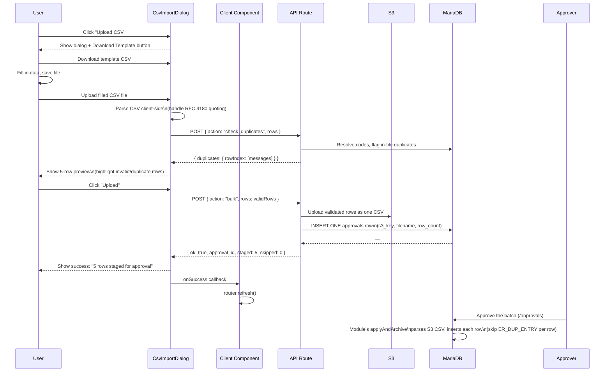

# Masters Module

> **Related docs:** [API Reference](./api-reference.md) · [Frontend Patterns](./frontend-patterns.md) · [Database Schema](./database-schema.md)

The Masters module is the **fully implemented reference module** of this ERP. It manages master data — the reference tables that every other module depends on (materials, products, suppliers, manufacturers, bills of materials). Study this module before building any new module.

## What "Master Data" Means

Master data records are created once and referenced repeatedly by transactional data (POs, manufacturing orders, invoices). Without master records, nothing else can function. The Masters module manages the lifecycle of these entities: create, bulk import, view, and update.

## Entities, Routes, and Tables

| Entity | Route | API Endpoint | Tables |
|--------|-------|-------------|--------|
| SKUs | `/masters/skus` | `POST /api/masters/skus` | `skus` |
| Vendors | `/masters/vendors` | `POST /api/masters/vendors` | `master_vendors`, `vendor_details` |
| Manufacturers | `/masters/manufacturers` | `POST /api/masters/manufacturers` | `master_mfgs`, `mfg_details` |
| Raw Materials | `/masters/raw-materials` | `POST /api/masters/raw-materials` | `master_rm`, `rm_vrm_dynamic`, `rm_mrm_fixed`, `vrm_history`, `history_vrm`, `history_mrm` |
| Packing Materials | `/masters/packing-materials` | `POST /api/masters/packing-materials` | `master_pm`, `pm_vrm_dynamic`, `pm_mrm_fixed`, `history_vrm`, `history_mrm` |
| Material Master | `/masters/material-master` | `POST /api/masters/material-master` | `master_rm`, `master_pm` |
| BOM Master | `/masters/bom-master` | `POST /api/masters/bom-master` | `bom`, `bom_details` |

## Server + Client Component Pattern

Every entity follows the same two-file pattern:

```
app/masters/<entity>/
├── page.tsx          ← Server Component (data fetch + auth gate)
└── <Entity>Client.tsx  ← Client Component (interactivity)
```

**Server Component** (`page.tsx`) responsibilities:
1. Call `auth()` — redirect to `/auth/signin` if no session
2. Call `resolveAccess(userId, roles, "/masters")` — redirect to `/auth/unauthorized` if `"none"`
3. Run a `query<Type[]>(sql)` via `lib/db.ts`
4. Render the Client Component, passing data as a prop

**Client Component** (`*Client.tsx`) responsibilities:
1. Receive `initialData` as a prop (typed array)
2. Render MasterToolbar + SearchInput + HTML table
3. Open AddRecordDialog for single creates, CsvImportDialog for bulk imports
4. On successful mutation: call `router.refresh()` to trigger the Server Component to re-fetch

```ts
// Example: app/masters/skus/page.tsx (Server Component)
export default async function SkusPage() {
  const session = await auth();
  if (!session) redirect("/auth/signin");

  const access = await resolveAccess(Number(session.user.id), session.user.roles, "/masters");
  if (access === "none") redirect("/auth/unauthorized");

  const skus = await query<Sku>("SELECT id, sku_code, name, brand, category, status, created_at FROM skus ORDER BY sku_code ASC");
  return <SkusClient initialSkus={skus} />;
}
```

## Data Flow Diagram

```mermaid
flowchart LR
    U["User action\n(Add record / Upload CSV)"]
    CC["Client Component\n(*Client.tsx)"]
    AR["API Route\n(/api/masters/*)"]
    DB["MariaDB\n(via lib/db.ts)"]
    SC["Server Component\n(page.tsx re-runs)"]
    T["Updated table\nin browser"]

    U --> CC
    CC -->|POST { action, ...fields }| AR
    AR -->|execute() or transaction| DB
    DB -->|{ id } or { inserted, skipped }| AR
    AR --> CC
    CC -->|router.refresh()| SC
    SC -->|query<T>()| DB
    DB --> SC
    SC --> T
```

## Shared Components (`components/masters/`)

### `AddRecordDialog`

A generic form dialog for creating a single record. Driven by a `fields: MasterField[]` configuration — no custom form code needed for standard entities.

```ts
<AddRecordDialog
  entityLabel="SKU"
  endpoint="/api/masters/skus"
  fields={[
    { key: "sku_code", label: "SKU Code", type: "text", required: true },
    { key: "name", label: "Name", type: "text", required: true },
    { key: "brand", label: "Brand", type: "text" },
    { key: "category", label: "Category", type: "text" },
    {
      key: "status",
      label: "Status",
      type: "select",
      options: ["active", "inactive", "discontinued", "new_launch"],
    },
  ]}
  onSuccess={() => router.refresh()}
/>
```

Posts `{ action: "create", ...formValues }` to `endpoint`. Shows inline error messages on failure.

### `CsvImportDialog`

A file-upload dialog for bulk imports. Generates a downloadable CSV template from the field config, parses the uploaded file client-side, shows a 5-row preview, then POSTs `{ action: "bulk", rows: validRows[] }` (optionally preceded by a `check_duplicates` preview call — see field configs that set `enableDuplicateCheck`).

The `bulk` action no longer inserts rows directly: the whole file is uploaded to S3 and staged as **one pending approval** covering the entire batch. Returns `{ ok, approval_id, staged, skipped }`. The actual per-row insert happens in that module's `applyAndArchive` handler once an approver approves the batch — see [CSV Import Workflow](#csv-import-workflow) below.

### `MasterToolbar`

Top toolbar that renders:
- An **Add** button → opens `AddRecordDialog`
- An **Upload CSV** button → opens `CsvImportDialog`
- A `SearchInput` for client-side filtering

### `SearchInput`

Controlled text input. On change, filters the displayed rows in the Client Component by matching the search term against row values. Client-side only — does not hit the API.

## Edit Actions — Vendors and Manufacturers

Vendors and Manufacturers support in-place editing via a pencil (✏) button in each table row. Clicking it opens a pre-populated dialog.

### Vendor Edit (`EditVendorDialog.tsx`)

Editable fields: `name`, `type` (rm/pm/both), `location`, `gst_number`, `status` (active/inactive/blacklisted/discontinued).

Submits `POST /api/masters/vendors` with `action: "update"` and `vendor_id`. The route runs a transaction updating both `master_vendors` and `vendor_details`.

### Manufacturer Edit (`EditMfgDialog.tsx`)

Editable fields: `name`, `location`, `gst_number`, `status` (active/inactive).

Submits `POST /api/masters/manufacturers` with `action: "update"` and `mfg_id`. The route updates both `master_mfgs` and `mfg_details`.

Both dialogs use `useEffect` (not `useState` initializer) to re-populate the form whenever a different row is selected, so switching between rows always shows the correct data.

### History Views (Create/Edit Audit Trail)

Every master except BOM/Recipe (which has its own dedicated history page — see BOM Master section) has a per-record history dialog showing every create/edit submission and its approve/reject outcome:

| Dialog | File | Backed by |
|--------|------|-----------|
| Manufacturer | `EditHistoryDialog.tsx` (`app/masters/manufacturers/`) | `GET /api/masters/manufacturers/history` |
| Vendor | `EditHistoryDialog.tsx` (`app/masters/vendors/`) | `GET /api/masters/vendors/history` |
| RM rate | `RmRateHistoryDialog.tsx` | `GET /api/masters/raw-materials/mrm-history` / `vrm-history` |
| PM rate | `PmRateHistoryDialog.tsx` | `GET /api/masters/packing-materials/mrm-history` / `vrm-history` |

Each row shown is one entry in the generic `history_masters_edits` audit table (`lib/queries/history.ts`), populated **alongside** (not instead of) the `approvals`/`approval_items` pending-review mechanism: `insertHistoryEntry` (`lib/master-routes/history-utils.ts`) writes one row per create/edit/delete submission with an auto-incrementing `version_no` per `(module, entity_id)`, and the shared approve/reject route calls `resolvePendingHistoryEntry` to mark that same row approved/rejected — safe to call unconditionally even for modules that don't participate. Each entry shows who submitted it, who approved/rejected it, and when.

---

## Edit Actions — Rate Masters

Vendor rate and manufacturer rate rows in the Raw Materials and Packing Materials pages also have pencil buttons. These open edit dialogs that submit via the existing `action: "add-rates"` endpoint, which performs a full upsert (archive old → update existing).

| Dialog | File | Calls |
|--------|------|-------|
| RM vendor rate | `EditRmVendorRateDialog.tsx` | `POST /api/masters/raw-materials` `add-rates` |
| RM mfg rate | `EditRmMfgRateDialog.tsx` | `POST /api/masters/raw-materials` `add-rates` |
| PM vendor rate | `EditPmVendorRateDialog.tsx` | `POST /api/masters/packing-materials` `add-rates` |
| PM mfg rate | `EditPmMfgRateDialog.tsx` | `POST /api/masters/packing-materials` `add-rates` |

PM edit dialogs pass `pm_id` directly in the request body to avoid the name+type lookup (which can fail if type is null). The `add-rates` handler short-circuits the `checkDuplicate` query when `pm_id` is provided.

All rate edit dialogs use a `toDateStr` helper to handle dates returned from the DB as `Date` objects rather than strings:

```ts
function toDateStr(val: unknown): string {
  if (!val) return ""
  if (val instanceof Date) return val.toISOString().slice(0, 10)
  return String(val).slice(0, 10)
}
```

### MOQ-Slab Vendor Pricing

A vendor rate row is keyed by `(rm_id/pm_id, vendor_id, moq)`, not just `(material, vendor)` — the same vendor can hold **multiple rate rows for the same material, one per MOQ (minimum order quantity) slab** (e.g. ₹120/kg at MOQ 100, ₹110/kg at MOQ 500). `checkDuplicate` for vendor rates matches on all three columns, so adding a new MOQ slab for an already-priced vendor is a new row, not an update. `EditRmVendorRateDialog.tsx` / `EditPmVendorRateDialog.tsx` edit one slab row at a time (MOQ is itself an editable field).

### Bulk CSV Upload for Rate Masters

RM and PM vendor/manufacturer rates support bulk CSV upload via **dedicated endpoints**, separate from each entity's main `/api/masters/*` route (which already has its own unrelated base-material `bulk`/`check_duplicates` actions):

| Dialog context | Endpoint | Field config |
|---|---|---|
| RM vendor rates | `POST /api/masters/raw-materials/vrm-bulk` | `rm-vrm-bulk-fields.ts` (`RM_VRM_BULK_FIELDS`) |
| RM manufacturer rates | `POST /api/masters/raw-materials/mrm-bulk` | `rm-mrm-bulk-fields.ts` (`RM_MRM_BULK_FIELDS`) |
| PM vendor rates | `POST /api/masters/packing-materials/vrm-bulk` | `pm-vrm-bulk-fields.ts` (`PM_VRM_BULK_FIELDS`) |
| PM manufacturer rates | `POST /api/masters/packing-materials/mrm-bulk` | `pm-mrm-bulk-fields.ts` (`PM_MRM_BULK_FIELDS`) |

Each endpoint supports two actions:
- `check_duplicates` — CsvImportDialog's preview-time deep check; resolves `rm_code`/`pm_code`, `vendor_code`, `mfg_code` against the DB (existence + active status) and flags duplicate material+vendor / material+mfg pairs within the same file, before the user ever hits "Upload".
- `bulk` — does **not** insert rows directly. It uploads the whole validated row set as one CSV to S3 (`uploadRowsAsCsv`) and stages the **entire file as a single pending approval** (module `RM_VRM_BULK` / `RM_RATE_BULK` / `PM_VRM_BULK` / `PM_RATE_BULK`) via `stageBulkUploadApproval`. The real per-row insert only happens in that module's `applyAndArchive` handler once an approver approves the batch — see `lib/approvals/module-handlers.ts` and `lib/approvals/handlers/raw-materials.ts` / `packing-materials.ts`.

Base-material bulk uploads (RM/PM/Vendor/Manufacturer `action: "bulk"` on the main `/api/masters/*` routes) follow the same approval-staged pattern — see the updated CSV Import Workflow section below.

---

## Raw Materials — Special Case

Raw Materials is the most complex master entity due to the rate master structure.

### Dual View

The `/masters/raw-materials` page supports two views, toggled by the `?view=` URL parameter:
- `?view=vendor` (default) — shows `rm_vrm` rows joined with `rm` (one row per vendor rate)
- `?view=manufacturer` — shows `rm_mrm` rows joined with `rm` (one row per manufacturer approval)

The `ViewToggle` component switches between views. Switching views triggers a full server-side re-fetch.

### Add Raw Material Wizard (`AddRawMaterialWizard.tsx`)

A multi-step modal wizard instead of the standard `AddRecordDialog`. Steps:

1. **Step 1 — Material details:** Name, make, INCI name, type, UOM, HSN code
2. **Duplicate check:** Calls `action: "check-RM"` — warns if a material with the same name + make + INCI already exists
3. **Step 2 — Vendor rates:** Add one or more vendor rates (vendor, price, MOQ, UOM, effective date)
4. **Vendor rate check:** For each vendor, calls `action: "check-vendor"` — shows existing rate if found
5. **Step 3 — Manufacturer approvals:** Select which manufacturing sites this material is approved for
6. **Final submit:** Single `action: "create-full"` POST — transactional insert of RM + vendor rates + manufacturer approvals

### Rate Archive Pattern

Two history tables are written when a rate is updated:

- **Vendor rate update (`rm_vrm_dynamic`):** First archived to `vrm_history` (legacy, via `archiveVendorRate`) and also to `history_vrm` (via `archiveToHistoryVrm`). Then the live row is updated in place.
- **Mfg rate update (`rm_mrm_fixed`):** The existing row is archived to `history_mrm` (via `archiveToHistoryMrm`) before updating. The `vendor_id` for the history row comes from `approved_vendor_id` on the rate row; if that is null, the first vendor linked to the RM in `rm_vrm_dynamic` is used; fallback is `0`.

Both archive steps happen inside the same database transaction as the update.

## Packing Materials — Special Case

Packing Materials mirrors the Raw Materials pattern with the same dual-view and wizard structure.

### Dual View

The `/masters/packing-materials` page supports two views:
- `?view=vendor` (default) — shows `pm_vrm_dynamic` rows joined with `master_pm`
- `?view=manufacturer` — shows `pm_mrm_fixed` rows joined with `master_pm`

### Add Packing Material Wizard (`AddPackingMaterialWizard.tsx`)

Same 3-step pattern as RM:

1. **Step 1 — Material details:** Name, type, HSN code, UOM, status — calls `action: "check-PM"` for duplicate check (name + type)
2. **Step 2 — Vendor rates:** Add one or more vendor rates; calls `action: "check-vendor"` per vendor; shows amber warning if rate already exists
3. **Step 3 — Manufacturer approvals:** Select manufacturing sites
4. **Final submit:** `action: "create-full"` — transaction insert of PM + vendor rates + manufacturer approvals

### Rate Archive Pattern

- **Vendor rate update (`pm_vrm_dynamic`):** Archived to `history_vrm` (via `archiveVendorRate`, which already targets `history_vrm` for PM). No separate `archiveToHistoryVrm` call — that would duplicate the entry.
- **Mfg rate update (`pm_mrm_fixed`):** Archived to `history_mrm` (via `archiveToHistoryMrm`). The `vendor_id` is looked up from `pm_vrm_dynamic` for the same `pm_id`; fallback is `0`. `pm_mrm_fixed` does not have an `approved_vendor_id` column (unlike `rm_mrm_fixed`).

---

## Material Master — Flat View

The `/masters/material-master` page provides a unified, simplified view of all materials without the rate data columns.

### What it is

- **Single toggle** between Raw Material and Packing Material (no vendor/manufacturer sub-toggle)
- Shows base material fields only: code, name, make (RM only), type, UOM, HSN code, status
- URL: `?material=rm` (default) or `?material=pm`
- Queries the `rm` / `pm` base tables directly — no JOINs

### Add Material Dialog (`AddMaterialDialog.tsx`)

A simple single-step dialog (no wizard). Fields shown depend on the active material toggle:

**Raw Material fields:** Name\*, Make\*, INCI Name\*, Type, UOM, HSN Code, Status

**Packing Material fields:** Name\*, Type\*, UOM, HSN Code, Status

Posts to the dedicated `POST /api/masters/material-master` route with `{ action: "create", material: "rm" | "pm" }`. No vendor or manufacturer data is collected — those are managed from the individual Raw/Packing Materials pages.

### File Structure

```
app/masters/material-master/
├── page.tsx               ← Server Component (fetches base rows, no joins)
├── MaterialToggle.tsx     ← RM / PM pill toggle (client, uses Link)
├── MaterialMasterClient.tsx  ← Table + search + status filter (client)
└── AddMaterialDialog.tsx  ← Simple create dialog (client)
```

---

## BOM Master

### Structure

A BOM (Bill of Materials) links a SKU to a manufacturing site with a versioned `bom_code`. It contains material line items (`bom_details`) specifying what raw and packing materials are needed, in what quantity, and at what cost.

```
bom (header)
├── sku_code → which product
├── mfg_id   → which plant
├── bom_code → version identifier
├── effective_from / effective_till → validity window (recipe-level)
└── bom_details[] (line items)
    ├── mtrl_type: "rm" or "pm"
    ├── mtrl_id: FK to rm or pm
    ├── amount: quantity per batch
    └── mtrl_cost: cost per unit
```

> **Recipe-level effective dates:** `effective_from`/`effective_till` moved from the line level to the BOM header (`master_bom`) — there is one validity window per recipe, not one per RM/PM line. `effective_from` is entered when the BOM is created/edited as a new version; `effective_till` is set automatically to the approval date when the recipe is discontinued or superseded. `details_bom`/`history_bom` still carry the same two columns for legacy rows predating this change (surfaced read-only on the BOM History page), but new lines no longer populate them.

### Bulk BOM Upload via CSV

`BOMMasterComponent.tsx` offers a `CsvImportDialog` (fields in `bom-bulk-fields.ts` → `BOM_BULK_CSV_FIELDS`) for creating many BOM lines across SKUs in one file: `sku_code`, optional `bom_code` (auto-generated if blank), `effective_from` (once per SKU group), `mtrl_type` (rm/pm), `mtrl_code`, `amount`, `uom`. Like the rate-master bulk uploads above, `POST /api/masters/bom-master` with `action: "bulk"` doesn't insert immediately — it stages the whole file as one `BOM_BULK` pending approval (`stageBulkUploadApproval`); the real per-row inserts happen in that module's `applyAndArchive` handler on approval. A separate `check_duplicates` action does the preview-time deep check (SKU/material code existence, RM%-total per SKU group) before the user uploads.

### Status Lifecycle

```
draft → in_review → active → inactive
                           → discontinued
```

A SKU can have multiple BOMs (different versions or different manufacturing sites). The currently active BOM is referenced by `sku_details.curr_bom_id`.

### BOMMasterComponent

`app/masters/bom-master/BOMMasterComponent.tsx` renders a flat joined view of `bom_details` + `bom` (one row per material line). Each row shows the BOM code, SKU code, material type and ID, amounts, costs, and effective dates.

## CSV Import Workflow

Bulk CSV upload is **approval-gated**, not a direct insert: the whole uploaded file is staged as a single pending approval, and the real inserts only happen once that approval is approved (see [Approval Flow](./api-reference.md) and `lib/master-routes/bulk-approval.ts`). This applies uniformly to base-material bulk uploads (RM/PM/Vendor/Manufacturer/BOM) and to the rate-master bulk uploads described above (`RM_VRM_BULK`, `RM_RATE_BULK`, `PM_VRM_BULK`, `PM_RATE_BULK`).


