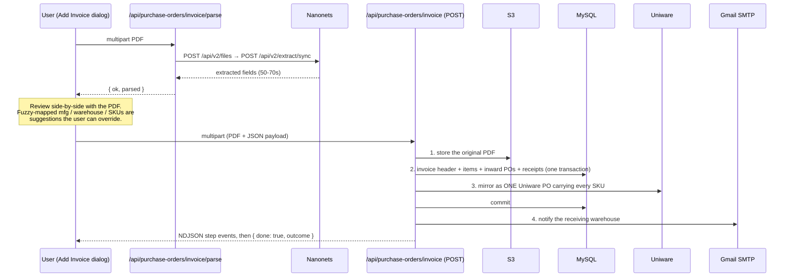

# PO Inwarding — Supplier Invoices, Inward POs, and Uniware

> **Related docs:** [API Reference](./api-reference.md) · [Database Schema](./database-schema.md) · [Environment & Scripts](./environment-and-scripts.md) · design spec: [`docs/superpowers/specs/2026-08-03-invoice-inwarding-design.md`](./superpowers/specs/2026-08-03-invoice-inwarding-design.md)

The PO Inwarding screen (`/po-tracking/po-inwarding`) is the goods-receipt desk's view of purchase orders. It shows the same table, filters and sorting as FG POs Tracking — `PoProcurementClient` runs with `mode="inwarding"`, which strips the procurement-side writes (create, bulk upload, mail, split, cancel) and leaves **Receive** as the row action. It lands on the "open" tab (`raised` + `partially_received`) rather than everything ever raised, and adds an `inward` tab that filters on `po_type` rather than status, so POs an invoice booked in already-complete stay reachable.

On top of that sits **Add Invoice** — upload a supplier's invoice PDF, have it read automatically, review the fields against the original, and turn each line into an inward PO (and, where the goods were already ordered, a goods receipt against the existing PO).

---

## The Flow



### Step order is a rollback strategy, not a preference

S3 objects, Uniware POs and sent email are not transactional resources — a DB rollback cannot undo any of them. `lib/invoice-inward.ts` therefore orders the steps **least-reversible-last** and compensates on the way out:

| Step | Reversible? | On failure |
|------|-------------|-----------|
| `s3` | Yes — `deleteFile()` | Nothing else has happened yet |
| `po` | Yes — `conn.rollback()` | S3 object deleted |
| `uniware` | **No** — Uniware exposes no cancel/delete for a PO | Runs *while the transaction is still open*: if the call fails, the DB rolls back and the S3 object is removed, and nothing was created upstream because the call itself failed |
| `email` | **No** | Runs **after commit**. Failure is reported, nothing is undone — the goods are physically here; a missed notification is not a reason to discard the receipt |

The cost is row locks held across the Uniware call for a second or two. Acceptable for a desk operation at this volume; it would not be for a hot path.

### Progress is streamed, not returned

`POST /api/purchase-orders/invoice` answers with `application/x-ndjson` — one JSON object per line — so the dialog can report each stage as it lands:

```
{"step":"s3","status":"ok"}
{"step":"po","status":"ok","data":{...}}
{"step":"uniware","status":"ok","data":{"purchaseOrderCode":"GM/2627/PO/2006"}}
{"step":"email","status":"skipped","message":"warehouse has no email on file"}
{"done":true,"outcome":{"ok":true,"created":[...],"received":[...],"uniwarePoCode":"..."}}
```

The HTTP status is always `200` once streaming starts: headers are on the wire before a later step can fail, so **failure travels as an event, not a status code**. Both routes set `runtime = "nodejs"` and `maxDuration = 300`.

---

## Nanonets Extraction (`lib/nanonets.ts`)

Two calls on `https://extraction-api.nanonets.com`:

| Call | Body | Returns |
|------|------|---------|
| `POST /api/v2/files` | multipart | `{ file_id: "file://<uuid>" }` |
| `POST /api/v2/extract/sync` | JSON | `{ result: { content: <our schema> } }` |

Two things that are easy to get wrong:

- It must be **`/extract/sync`, not `/parse/sync`**. `parse` only emits markdown/HTML and ignores the schema entirely, silently returning prose instead of fields.
- The schema travels as `extraction_config.json_options` (verified against the API's own `openapi.json` → `ExtractConfig`).

`EXTRACTION_SCHEMA` mirrors `types/invoice.ts`: header fields (invoice number/date, e-way bill, vehicle number, currency, both GSTINs, bill-to/ship-to blocks, buyer PO reference, grand total) plus `line_items[]` (item code, description, batch, mfg/expiry, HSN, qty, rate, MRP, discount, GST %, amount, total). `normalizeParsedInvoice` coerces the response into `ParsedInvoice`.

**Extraction takes 50–70 seconds on a one-page invoice.** Every caller has to be built for that: no default fetch timeouts, and a UI that says so.

## Fuzzy Mapping (`lib/invoice-mapping.ts`)

A supplier writes "REVE PHARMA", "Guwahati" and "Mcaf407"; the masters hold a manufacturer row, a warehouse row and a `master_skus` row whose codes rarely match character-for-character. `matchMfg` / `matchWarehouse` / `matchSku` pick the most likely master record so the review form opens pre-filled.

- Uses **Fuse.js** (already a dependency via `components/ui/FuzzySelect`), threshold `0.3` — deliberately tighter than FuzzySelect's browsing threshold of `0.4`, because this picks a value on the user's behalf and a confidently wrong guess costs more than a blank field.
- Exact case-insensitive hits short-circuit Fuse, so a supplier code that already equals a master code can never lose to a fuzzier-but-shorter candidate.
- `matchSku` tries the code first (more discriminating), and only falls back to the product name when the code finds nothing.
- Pure and network-free, so `scripts/_check-invoice-mapping.ts` exercises it directly.

**Every result is a suggestion, never a silent commit.**

---

## The Add Invoice Dialog

`app/po-tracking/po-inwarding/` — three phases in one dialog (`pick` → `parsing` → `review`), split across files so the orchestration reads as phases rather than fetches:

| File | Responsibility |
|------|----------------|
| `AddInvoiceDialog.tsx` | Orchestration only — phases, step toasts, submit |
| `invoice-form.ts` | Form model, builders, derived values and `collectProblems` validation. React-free, so the parsed → reviewable mapping can be read and exercised without rendering |
| `invoice-api.ts` | The three requests (`parseInvoiceFile`, `fetchOpenPos`, `commitInvoice`), throwing `InvoiceApiError` with the server's own message |
| `invoice-draft.ts` | Crash/close recovery — checkpoints the whole review, PDF included, to IndexedDB |
| `InvoiceFields.tsx` / `InvoiceLineItems.tsx` | The two halves of the review pane |
| `useSplitPane.ts` | Drag-to-resize split between the PDF preview and the form |
| `InvoiceHistoryDialog.tsx` | Past invoices, expanding to line items and the POs each line resolved to |

**Nothing is persisted server-side until "Create Inward POs".** The PDF is posted straight to the parser and previewed from a local blob URL; the S3 upload is the first step of submit. Abandoning a review leaves nothing on the server. The cost is that a parse **Retry** re-posts the file.

**Why IndexedDB, not localStorage:** extraction takes ~60s and the review that follows is real work, so losing it to a stray Escape is expensive. The PDF has to survive too — localStorage holds ~5 MB of *strings* and a 10 MB PDF is ~13 MB once base64'd. IndexedDB stores a `File` directly, no encoding, with a quota measured against free disk. Every draft operation is best-effort: storage can be unavailable (private mode, blocked cookies, quota exhausted) and a draft that fails to save must never take the invoice flow down with it.

### Per-line "Reference PO"

Each line can point at an existing open PO (`raised` or `partially_received`) for that manufacturer, fetched on demand from `GET /api/purchase-orders/open-for-receive?mfg_id=`. That's fetched on demand rather than shipped with the page because the manufacturer isn't known until the invoice has been parsed, and every open PO for every manufacturer would be most of the PO table.

When a line references a PO, it **still raises its own inward PO** *and* books a goods receipt against the referenced one — so the line carries two PO links (see `link_type` below).

---

## What Gets Written

| Table | Rows |
|-------|------|
| `supplier_invoices` | One header per invoice. `UNIQUE (mfg_id, invoice_no)` — re-submitting the same invoice is a DB error rather than a second round of credited `received_qty`. Keyed on both columns because two manufacturers can each legitimately issue "INV-001". |
| `supplier_invoice_items` | One row per invoice line, carrying both the printed value (`parsed_sku_code`) and the mapped one (`sku_code`) |
| `purchase_orders` | One inward PO per line, `po_type = 'inward'`, numbered `<BRAND>-INW-<YYYYMM>-<NNN>`. `expected_on` is the **invoice's own date** (backdated on purpose: the goods have already shipped) |
| `history_pos` | The audit row each receipt writes, via `lib/po-receive.ts` |

`supplier_invoice_items` holds two PO links, because a line can relate to two orders:

| Column | Meaning |
|--------|---------|
| `po_id` | The inward PO **this line raised** (always set for new rows) |
| `received_against_po_id` | The pre-existing PO it was **booked against**, when there is one |
| `link_type` | `created` = a plain inward line · `received` = it also credited an existing order |

The inward PO is inserted one of two ways:

| Line | Insert | Status |
|------|--------|--------|
| Plain inward line | `insertInward` | `raised` |
| Line that also references an existing PO | `insertInwardReceived` — `received_qty = qty`, `reference_po` = the parent's `po_no` | `received` (booked straight in as fully received: the goods are physically here, which is the whole point of the invoice) |

Referenced lines take their brand from the parent PO's number rather than the SKU, because such a line needn't carry a SKU at all.

`mfg_date` / `expiry` are `VARCHAR`, not `DATE`: invoices often print them month-only (`Jun-2026`).

Before any transaction opens, `resolveBrands` validates every mapped SKU — an unknown code is a `400 sku_not_found`, and a SKU that isn't `active` is a `400 sku_not_active`. Inward PO numbers use the same brand-code mapping as procurement's single-PO route, so an inward PO number is recognisable alongside the ones procurement raises.

### Shared receive logic (`lib/po-receive.ts`)

`receivePo(conn, poId, qty, userId)` credits `received_qty`, auto-closes the PO once the remainder falls inside `poTolerance`, and writes the `history_pos` row. It was extracted from the manual receive route so the automated path credits quantities exactly the same way — two copies of the tolerance/auto-close rule would eventually disagree, and the automated path is the one nobody watches.

- Receivable statuses: `raised`, `punched`, `partially_received` (`punched` because the manual desk flow has always allowed it).
- `SELECT ... FOR UPDATE` holds the row for the rest of the transaction, so a concurrent receipt blocks instead of reading a stale `received_qty`.
- It takes an already-open connection and **never** calls `beginTransaction`/`commit`/`rollback` — the route owns the transaction (see CLAUDE.md's nested-transaction rule).

---

## Uniware (Unicommerce) Mirror — `lib/uniware.ts`

Our model is **one PO per SKU**; Uniware's mirror is **one PO carrying every SKU on the invoice**. That code is stamped onto every inward PO row (`purchase_orders.uniware_po_code`) as well as the invoice header (`supplier_invoices.uniware_po_code`), so the PO list — the hottest query on that table — doesn't grow a join.

| Call | Purpose |
|------|---------|
| `POST /oauth/token?grant_type=password` | Sign in (credentials in the query string; this endpoint ignores a form body) |
| `GET /oauth/token?grant_type=refresh_token` | Renew, 300s ahead of real expiry so a request can't carry a dying token |
| `POST /services/rest/v1/purchase/purchaseOrder/create` | Create the PO |
| `GET` PO document | `fetchPurchaseOrderPdf(code)` — attached to the warehouse email |

Two traps this module exists to contain:

1. **Uniware answers HTTP 200 with `{ successful: false, errors: [...] }` on a business failure.** `res.ok` is not a success check here.
2. **`purchaseOrder/create` is facility-scoped** — the `Facility` header decides where the PO lands, unlike the facility-agnostic Item Master export.

The code is stamped onto every inward PO the invoice created (`buildSetUniwarePoCode`) **after the mirror succeeds but inside the same transaction**, so no row ever commits quoting a Uniware PO that doesn't exist.

We deliberately **do not** send our own `purchaseOrderCode` on create: leaving it out lets the facility's own series number the PO (e.g. `GM/2627/PO/2006`), which is the reference the manufacturer recognises and the one quoted in the notification email. It exists nowhere else, which is why it is stored.

`uniwareEnabled()` is false when the `UNIWARE_*` vars are unset, and the mirror step is then **skipped** rather than failing — the app boots and inwards invoices without Uniware configured.

> ⚠️ `UNIWARE_VENDOR_CODE` defaults to `Test_Vendor` and `UNIWARE_FACILITY` to `TEST_FACILITY`. Uniware vendors are configured per facility and are **not** the same identifier as `master_mfgs.code` (pushing that fails with `Vendor [MFG-002-AJA] is not configured for the facility`). Until a real mfg → vendor mapping exists, both **must** be overridden before going live or every PO lands against the test vendor.

## Warehouse Notification — `sendInwardInvoiceEmail`

Deliberately not `sendMfgSelectionEmail`: that one reports PO status *to the manufacturer* and attaches PO documents we generate. This one goes to the **receiving warehouse** — the manufacturer already knows the order and shipped the goods; it's the warehouse that needs the paperwork for stock arriving at their door.

- Recipients: `entity_emails` rows with `entity_type = 'warehouse'` and `entity_code` = the `master_warehouse.name` that `purchase_orders.destination` stores. (The column was `ENUM('vendor','mfg')`, so inserting `'warehouse'` was silently coerced to `''` — widened by `prisma/add_warehouse_entity_email_type.sql`.)
- Attachments: the original invoice PDF, plus the Uniware PO document when it can be fetched (best-effort — the goods are already booked).
- Subject: `Create PO : <MFG NAME> || Invoice No : <no> || <D-MON-YY>`, left as the MIS team wrote it.
- Signed with the filer's own name plus `MAIL_SIGNATURE_TITLE` (default `MIS Executive`).
- **No recipients on file returns `false`, it does not throw** — a warehouse with no email is a data gap, not a failure of an already-committed invoice.

---

## Endpoints

| Endpoint | Purpose |
|----------|---------|
| `POST /api/purchase-orders/invoice/parse` | Multipart PDF → `{ ok, parsed }`. `422 unparseable` when nothing usable came back (wrong file, unreadable scan) rather than an empty success the user has to diagnose from a blank form. `10 MB` cap, PDF only. |
| `POST /api/purchase-orders/invoice` | Multipart (`file` + JSON `payload`) → NDJSON step stream. Validated with `invoiceInwardSchema`; no `schema` on the gateway because it's multipart. |
| `GET /api/purchase-orders/invoice` | Invoice history list, `?limit` (clamped 1–100) `&offset` |
| `GET /api/purchase-orders/invoice/[id]` | One invoice: header, items, and the POs each line resolved to |
| `GET /api/purchase-orders/open-for-receive?mfg_id=` | Open POs for the per-line Reference PO picker. Entity-scope checked. |

## Files

| Path | Role |
|------|------|
| `lib/invoice-inward.ts` | The whole committed sequence and its compensation rules |
| `lib/nanonets.ts` | Extraction wire format |
| `lib/invoice-mapping.ts` | Fuzzy invoice → masters mapping |
| `lib/uniware.ts` | OAuth + PO create/fetch |
| `lib/po-receive.ts` | Shared receipt/tolerance/auto-close logic |
| `lib/queries/supplier-invoices.ts` | SQL for both invoice tables |
| `types/invoice.ts` | `ParsedInvoice`, `ParsedLineItem`, `OpenPoOption`, invoice-history row types |
| `prisma/add_supplier_invoices.sql`, `add_inward_po_type.sql`, `add_invoice_item_reference_po.sql`, `add_invoice_uniware_po_code.sql`, `add_po_uniware_code.sql`, `add_warehouse_entity_email_type.sql` | The migrations, in the order they were applied |
| `scripts/_check-invoice-mapping.ts`, `_check-inward-count.ts`, `_check-inward-sequence.ts`, `_check-inward-mail-summary.ts`, `_check-uniware-push.ts`, `_check-uniware-po-pdf.ts`, `_check-backdated-po.ts` | Verification scripts for each part of the flow |
